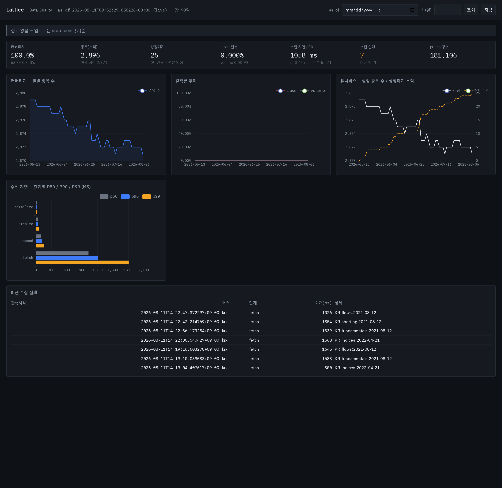
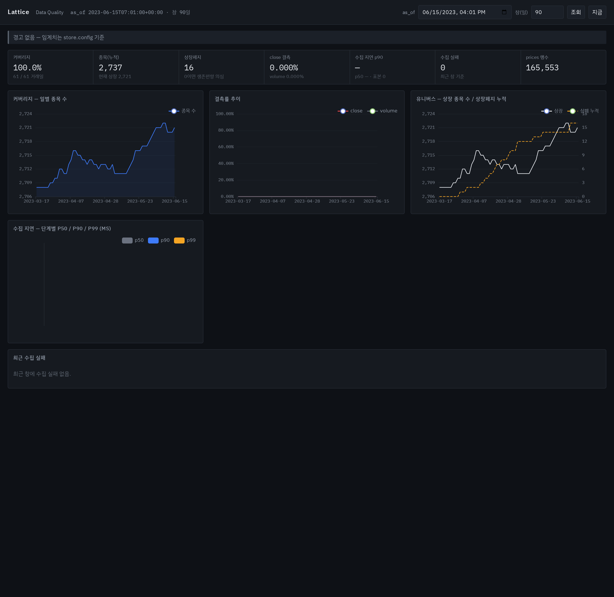
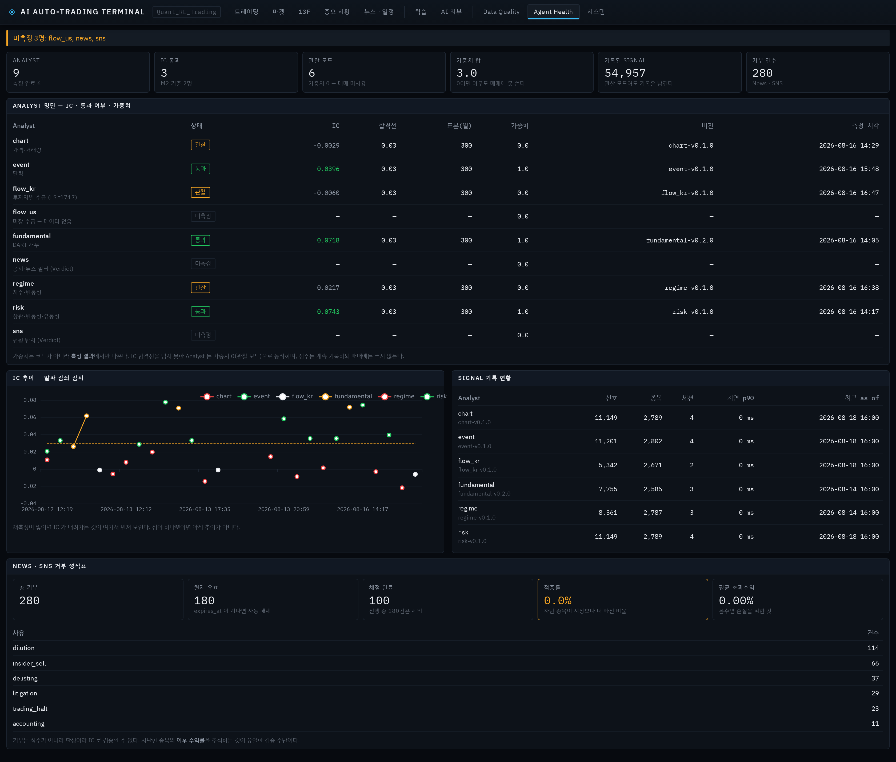

# Quant_RL_Trading

**멀티에이전트 AI 사모펀드.** 목표는 시장보다 덜 잃고 시장보다 더 버는 것 — 한 숫자로 말하면 **정보비율(IR)** 이다.

격자(quant_rl_trading)는 옵션 가격결정의 이항 격자에서 온 말이자, 이 시스템의 다층 에이전트 구조 그 자체다.

```
Collector  →  Analyst  →  Selector  →  Allocator  →  Executor
  수집         분석 9      후보 선정     비중·타이밍     주문
                                          (RL)
                    Auditor        ModelOps
                  성과 귀속       모델 감시
```

> Analysts score, the Selector nominates, the Allocator sizes, the Executor acts.

[](#검증)
[](#요구사항)
[](#불변식--이-프로젝트의-헌법)

---

## 왜 처음부터 다시 만드는가

이 프로젝트에는 선행 프로젝트가 둘 있다. `LS_KR`(국장)과 `LS_USA`(미장)다. 강화학습 기반으로 만들었지만 **학습이 되지 않아 사실상 룰 기반으로 동작한 실패 사례**다.

부검해서 원인을 먼저 찾았다 ([`docs/postmortem-ls.md`](docs/postmortem-ls.md)):

| 무엇이 잘못됐나 | 결과 |
|---|---|
| 안전장치가 RL 출력을 덮어씀 | **액션 반영률 0%** — RL이 낸 결정이 하나도 집행되지 않았다 |
| 상태값에 목표 비중만 들어감 | RL이 자기가 하지 않은 행동으로 보상받았다 |
| 미장은 obs 42 vs 모델 128 차원 불일치 | 매 리밸런싱이 실패하면서도 계속 운영됐다 |
| **중단 기준이 없었음** | 9차 재정식화까지 끌고 가다 폐기 |

그래서 Quant_RL_Trading의 규칙은 하나다 — **배관은 재사용, 두뇌는 새로.** LS API 인증·주문 전송·휴장일 처리처럼 실거래로 검증된 I/O는 이식하고, 학습 루프·상태값 설계·보상 함수는 가져오지 않는다.

그리고 **재발 방지 지표**를 상시 감시한다.

> **액션 반영률** = RL이 낸 결정 중 실제로 집행된 비율. **30% 미만이면 경고.** 그건 RL이 아니라 룰 시스템이다.

---

## 불변식 — 이 프로젝트의 헌법

위반하면 프로젝트 전체가 거짓이 된다. 문서의 지시는 권고지만, 이것들은 **테스트와 정적 가드로 강제**된다.

1. 모든 데이터 접근은 `store.get(table, as_of=...)` 를 경유한다
2. `datetime.now()` 직접 호출 금지 — 시간은 `Clock` 주입으로만
3. 모든 저장 레코드는 `observed_at` 을 갖는다 (없으면 저장 거부)
4. 데이터는 append-only. 정정은 `revision` 을 올린 새 행으로
5. 백테스트와 라이브는 같은 코드를 쓴다. `Clock`만 바꿔 낀다
6. Executor 안에는 AI가 없다. 순수 코드만
7. **실현 비중**을 Allocator에 되먹인다 (목표 비중이 아니라)
8. LLM 출력은 보상 함수에 들어가지 않는다 — Claude는 심판이 아니라 해설자다
9. 모든 대시보드 API는 `as_of` 파라미터를 받는다
10. 임계치는 `store.config` 에서 읽는다. 하드코딩 금지

가장 중요한 구분은 **이중시간**이다.

```
valid_from    그 사실이 실제로 유효해진 시점
observed_at   내가 그것을 알 수 있었던 시점
```

둘을 헷갈리면 백테스트가 조용히 미래를 본다. 그리고 그 사실은 화면 어디에도 드러나지 않는다.

---

## 지금까지 확인된 것

### M1 — 데이터 창고 + 리플레이 엔진 ⚠️ (2026-08-15 재판정)

```
$ uv run python tools/verify_m1.py

[FAIL] 과거 5년치 전종목 curated 백필 (상장폐지 종목 포함)
       구간 2021-08-11 ~ 2026-08-14 (5.0년)
       거래일 1226 / 기대 1225 = 100.1% (참고값)
       prices 3,392,232행, 종목(누적) 3,221개
       결측 세션 1개: 2026-08-11  ← 판정 기준
       기대 밖 세션 2개: 2026-06-03, 2026-07-17  ← 휴장일에 행이 있다

[PASS] 임의 과거 날짜 100개 리플레이 → 전부 결정론적
       표본 100개 (시드 20260811), 각 날짜를 두 번 실행해 바이트 비교
       불일치 0건 / 빈 주문 0건 / 서로 다른 결과 100종 100일

[PASS] 결정론 / 미래 훔쳐보기 / 생존편향 / 정정공시 테스트 통과
[PASS] datetime.now() 직접 호출 0건, 데이터 직접 조회 0건 (CI 검사)

[PASS] 지연 실측 수집 시작 (p50/p90 대시보드 표시)
       표본 4,892건, 전체 p50 84.3ms / p90 1069.2ms
         fetch      p50 1043.2ms  p90 1227.2ms
         append     p50  101.4ms  p90  120.9ms
         archive    p50   36.6ms  p90   45.8ms
         normalize  p50   14.9ms  p90   19.2ms

```

`서로 다른 결과 100종 / 100일` 이 중요하다. **아무것도 하지 않는 구현도 "두 번 실행해서 같다"는 통과한다.** 그래서 빈 주문 건수와 결과의 가짓수를 함께 센다.

#### 2026-08-15 — M1 이 다시 FAIL 로 내려갔다. 그게 정답이다

한동안 이 화면은 `커버리지 100.0%` 한 줄이었고 **통과하고 있었다.** 그 통과가 거짓이었다는 것을 그날 알았다.

- **커버리지가 100% 미만이 아니라 105.87% 였다.** `collect_coverage` 가 `market` 을 안 넘겨 KR·US 를 통째로 셌고, 한국 휴장일 72일을 미장 행이 "커버된 세션" 으로 메웠다. **결측이 항상 0 으로 보인 이유**다.
- **거래일 달력이 2026-06-03(지방선거)·07-17(제헌절)을 거래일로 줬다.** `exchange_calendars` 가 뒤늦게 지정된 휴일을 모른다. 그 이틀은 KRX 가 전 종목 종가 0 으로 응답한 날이고, 그 0 이 창고에 남아 **유령 세션**이 됐다.
- **2026-08-11 은 진짜로 비어 있다.** 공휴일이 아닌데 행이 0 이다 — 수집이 하루를 통째로 빠뜨렸고 아무도 몰랐다.

통과 조건을 `커버리지 >= 100%` 에서 **`결측 세션이 없다`** 로 바꿨다. 전자는 **"구멍 하나 + 유령 하나" 를 만점으로 읽는다** — 두 결함이 상쇄돼 통과하고 있었고, 유령 세션을 지우면 오히려 99.92% 로 떨어져 FAIL 했을 것이다. **고치면 떨어지는 기준은 기준이 아니다.**

지금 화면은 두 고장이 각자 이름을 갖고 따로 찍힌다. 상쇄가 불가능해졌다.

### Data Quality 화면



실제 창고(338만 행) 위에서 도는 화면이다. 커버리지 100%, 결측 0%, 수집 지연 p50/p90, 상장폐지 누적, 그리고 **최근 수집 실패**까지 보여준다. 화면에 찍힌 실패 7건은 꾸민 것이 아니라 실제로 막혔던 수집이다 — 조용히 실패하는 파이프라인이 가장 위험하므로 실패를 숨기지 않는다.

임계치(커버리지 경고선, 결측 경고선, 지연 경고선)는 전부 `store.config` 에서 읽는다. 화면이 자기 숫자를 따로 들면 학습 설정과 어긋난다.

### 타임머신이 실제로 동작한다

같은 화면을 `as_of`만 2023-06-15로 바꿔 부른 결과다.



| | 라이브 (2026-08-11) | `as_of=2023-06-15` |
|---|---|---|
| 종목(누적) | 2,896 | **2,737** |
| 상장폐지 | 25 | **16** |
| prices 행수 | 181,106 | **165,553** |
| 수집 지연 p90 | 1058 ms | **—** |

마지막 줄이 핵심이다. **지연 실측 레코드는 2026년에 관측됐으므로 2023년 시점에는 존재할 수 없다.** 화면이 그것을 `—` 로 정직하게 비운다 — 게이트가 `observed_at <= as_of` 를 실제로 강제하고 있다는 증거다. 여기서 숫자가 나왔다면 화면이 미래를 보고 있는 것이다.

세션 단위로도 확인했다.

| 요청 | 마지막 세션 |
|---|---|
| `as_of=2023-06-15T15:29:00+09:00` (장 마감 전) | 2023-06-14 |
| `as_of=2023-06-15T16:01:00+09:00` (공표 후) | **2023-06-15** |

백필된 데이터의 `observed_at` 은 **원 공표 시각**(세션 종료 + 공표 지연)이다. 백필을 돌린 시각이 아니다. 이걸 틀리면 5년치가 통째로 거짓이 된다.

### 생존편향이 데이터에서 제거됐다

```
상폐 종목 표본: KR:012510 더존비즈온, delisted_on=2026-07-15
  상폐 30일 전 유니버스 조회 → is_listed=True
  상폐 30일 전 시세 조회    → 6행, 마지막 종가 120,000
  상폐 이후 조회            → is_listed=False
```

오늘 명단으로 과거를 그렸다면 이 회사는 처음부터 없던 것이 되고, 그 종목에서 난 손실은 백테스트에서 영원히 사라진다.

### Agent Health 화면



Data Quality 가 "데이터가 썩고 있나"를 본다면 이 화면은 **"에이전트가 썩고 있나"** 를 본다. 데이터가 완벽해도 Analyst의 IC는 시간이 지나면 감쇠한다(알파 소멸). 그걸 못 보면 죽은 신호에 계속 가중치를 주게 된다.

지금 화면은 **아무것도 검증되지 않았다고 정직하게 말한다** — IC 통과 0명, 가중치 합 0.0, 미측정 9명. 좋아 보이게 꾸미지 않았다. 여기서 가장 중요한 숫자는 IC가 아니라 **가중치**다.

> 가중치는 코드가 아니라 **측정 결과**에서만 나온다. IC 합격선을 넘지 못한 Analyst는 가중치 0(관찰 모드)으로 동작하며, 점수는 계속 기록하되 매매에는 쓰지 않는다.

미측정 Analyst도 명단에서 빼지 않는다. 빠지면 "왜 없지"를 아무도 묻지 않게 된다.

### M2 — Analyst 투입 + IC 검증 ✅

IC 측정 파이프라인이 **실제로 누수를 잡는지** 먼저 증명했다. 검증기를 만들어 놓고 "잘 도네" 하고 넘어가면 아무것도 검증하지 않는 채로 통과 도장만 찍는다.

실제 창고(338만 행, 타깃 751,394행 / 261일) 대조군:

| 대조군 | IC | 통과 | 가중치 |
|---|---|---|---|
| 타깃을 그대로 점수로 (누수) | **1.0000** | ✅ | 1.0 |
| 무작위 점수 | **0.0006** | ❌ | **0.0** |

일별 횡단면 타깃 평균 `1.1e-16` — 시장 전체 수익이 제대로 빠졌다는 뜻이다. 이걸 안 빼면 모든 Analyst가 그냥 베타를 학습하고 IC가 좋아 보인다.

> **백테스트 IC가 0.15처럼 나오면 재능이 아니라 버그다.** 먼저 누수를 의심할 것.

### M3 — Selector + Executor 🚧

완료 기준을 사람이 손으로 켜지 않는다. `uv run python tools/verify_m3.py` 가 실제 창고 위에서 판정한다.

```
[미측정] shadow 10거래일 무사고
       체결이 1일 있었는데 회계가 그 체결을 반영하지 않았다
       → 검증된 무사고 체결일 0/10

[FAIL]   OOS 백테스트 MDD 20% 이내
       nav_daily 224행, 2025-09-16 ~ 2026-08-14 · MDD -23.9% (게이트 -20%)

[PASS]   킬스위치 실제 발동 테스트 통과 — 14 passed

[미측정] 실전 소액 투입 — trades 0행(실전 체결이 아직 없다)

[미측정] 슬리피지 실측이 모델 예측의 ±30% 이내
       비교할 실제 체결이 없다

PASS 1 · FAIL 1 · 미측정 3 / 5
```

**`미측정`이 `FAIL`과 다른 상태인 것이 이 검증기의 요점이다.** 넷 다 "고장났다"가 아니라 **"아직 잴 수 없다"**이고, 무엇이 갖춰지면 잴 수 있는지를 함께 출력한다. FAIL로 적으면 고장으로 읽히고 PASS로 적으면 거짓이 된다.

M1 검증기의 교훈이 여기서도 적용된다 — **매매 0건이면 MDD는 언제나 0%다.** 완벽한 성적이 아니라 아무것도 안 한 것이므로, NAV가 고정돼 있으면 통과가 아니라 미측정으로 뺀다.

#### -23.9% 는 전략의 숫자가 아니다 — 귀속시켰다

이 숫자는 하루 만에 세 번 바뀌었다. **바뀐 것은 전략이 아니라 결함이다.**

| | MDD | 왜 |
|---|---|---|
| 1차 | **-32.6%** | 가용 현금을 보는 코드가 없어 **레버리지 3.2배**로 돌았다. 현금이 -1.96억까지 갔다 |
| 2차 | **-23.9%** | 현금 제약 후. 그런데도 게이트 초과 |
| 귀속 | — | **-10.9%p 이상이 종가 0 세션 하나** 때문이었다 |

휴장일(달력 오류로 세션을 돌렸다)의 종가 0 이 60일 상관행렬에 들어가면 `pct_change` 가 **전 종목을 같은 날 -100%** 로 만든다. 쌍상관이 0.168 → 0.644 로 뛰고, 상관 감점으로 후보 절반이 음수 알파가 되어, Allocator 가 살아남은 셋에 상한(15%)까지 몰아준다. **종가 0 행 하나만 빼고 같은 `select()` 를 돌리면 원래 포트폴리오가 24/24 복원된다** — 반사실로 인과를 닫았다.

문서가 지목하던 "매도 미체결" 은 **부호까지 반대였다**(하락일 체결률이 오히려 높고 기여는 NAV 의 0.14% 이하). 대신 아무도 안 보던 것이 나왔다 — **보유 중인데 후보 밖인 종목은 매도 주문이 아예 안 나갔다.** 시세를 후보만 조회해서 그 종목들이 `price=0` → "가격 없음" 스킵이 된다. 실측으로 3,109건(종목×일) 중 **매도 0건**, 11세션 연속 주문 0건. 포트폴리오가 **한 방향 래칫**이었다.

넷을 다 고치고 재실행 중이다. **그 잔여 MDD 가 처음으로 전략의 숫자다.**

그리고 그때도 남는 것이 있다 — 오염이 전혀 없던 구간(2026-02-25~06-03)에 **코스피 +44.67% 인데 펀드 -9.44%** 였다. 알파 -54%p. **MDD 가 게이트를 통과해도 이건 남고, 그건 M3 가 아니라 IC 로 되돌아가야 하는 문제다.**

---

## 구조

```
quant_rl_trading/
  store/        데이터 게이트 — Parquet/DuckDB를 만질 수 있는 유일한 패키지
  replay/       Clock, 이벤트 로그, 에이전트 캐시, 체결 시뮬레이터
  collectors/   수집 전담. 점수를 내지 않는다
  analysts/     점수·판정을 낸다. 수집하지 않는다
  selector/     후보 선정, Analyst 가중치 진화        (M3)
  allocator/    RL 제어기 — 목표 비중                  (M4)
  executor/     주문 변환, 리스크 가드, 킬스위치        (M3)
  auditor/      귀속 분석                              (M5)
  modelops/     재학습 판정, 드리프트 감지              (M5)
  dashboard/    Flask + ECharts. 모든 API가 as_of를 받는다
  schemas/      Order, Signal, Verdict
tools/
  backfill.py     백필 실행기 + 검증 리포트
  measure_ic.py   Analyst IC 측정
  measure_slippage.py  슬리피지 실측 vs 모델 예측 (M3 완료 기준 5번)
  verify_m1.py    M1 완료 기준 검증
  verify_m3.py    M3 완료 기준 검증 — PASS/FAIL/미측정 3상태
  verify_live_order.py  실계좌 주문 검증 — 국장·미장, 8단계 사람 확인, 기본 드라이런
  preflight_live_order.py  실주문 사전점검 — 조회 TR 만, 주문 경로가 파일에 없다
  invariant_guard.py  불변식 정적 가드 (AST 기반)
  find_dead_code.py   호출부가 0건인 공개 함수 (배선 누락 탐지)
```

### 데이터 흐름

```
Collector → data/raw/ (원본 보존, 삭제 금지)
             ↓ 정규화
          store.append()  ← observed_at 없으면 거부
             ↓
      data/curated/{table}/observed_date=YYYY-MM-DD/
             ↓
          store.get(as_of=...)  ← observed_at <= as_of 강제
             ↓
     Analyst → Selector → Allocator → Executor
```

---

## 데이터 소스 — 결정 기록

이 부분은 시행착오가 많았고, 기록해 둘 가치가 있다.

| 소스 | 결과 |
|---|---|
| 네이버 계열 무료 시세 | ❌ **수정주가만 준다.** 2021-04-08 카카오 종가를 109,992로 돌려준다 (실제 548,000). 일주일 뒤 액면분할이 소급 반영된 값이라 전 구간이 미래를 본다 |
| pykrx (data.krx.co.kr) | ⚠️ 원주가·상폐종목 모두 제공하지만 **약관상 자동화 수집 금지.** 대량 조회로 IP 차단됨 |
| KRX Open API | ✅ 정식 경로. 다만 **수급·공매도·PER/PBR이 없다** (엔드포인트 탐색으로 확인) |
| LS `/stock/frgr-itt` (t1717) | ✅ **투자자별 수급.** 경로를 `/stock/market-data`로 착각해 한 번 "없다"고 잘못 결론냈다 |
| OpenDART | ✅ 재무제표 + **접수일(`rcept_dt`)** — `observed_at` 을 정확히 찍을 수 있다 |

**약관을 지킨다.** 차단당한 뒤 요청 간격을 늘려 탐지를 피하거나 IP를 바꾸는 방법은 쓰지 않았다. 명시적으로 적용된 접근 제한을 뚫는 것이고, 약관 위반을 알고도 계속하는 것이 되기 때문이다.

PER/PBR은 DART 재무 + 주가로 직접 계산한다. 남이 계산해 준 값보다 **시점 정합성이 정확하다.**

---

## 실행

### 요구사항

Python 3.12, [uv](https://docs.astral.sh/uv/). 데이터 소스 키는 `.env.example` 참고.

```bash
git clone https://github.com/MintKangaroo/Quant_RL_Trading.git
cd Quant_RL_Trading
uv sync
cp .env.example .env   # 키를 채운다
```

### 백필

```bash
uv run python tools/backfill.py --years 5 --symbols 10   # 시험 실행 (10종목)
uv run python tools/backfill.py --years 5                # 전체
uv run python tools/backfill.py --table flows-ls         # 투자자별 수급
uv run python tools/backfill.py --report                 # 검증 리포트
```

중단해도 된다. 다시 같은 명령을 치면 이미 들어간 세션은 건너뛰고 이어받는다. 재개의 기준은 체크포인트 파일이 아니라 **창고의 매니페스트**라, 체크포인트가 유실돼도 정확하다.

### 대시보드

```bash
# shadow 창고를 본다. **실전 창고는 자본이 0이라 화면이 비어 있다.**
QUANT_RL_DATA_ROOT=data/_shadow uv run python -m flask \
    --app quant_rl_trading.dashboard.app:create_app run --port 5057
```

헤더 배지가 모드(LIVE/SHADOW/BACKTEST)를 **창고 경로에서 유도해** 띄운다.
shadow 를 보면서 실전이라고 착각하는 것이 이 화면에서 가능한 가장 비싼 오해다.

```bash
# 모든 엔드포인트가 as_of 를 받는다
curl 'localhost:5057/api/data-quality/summary'
curl --get --data-urlencode 'as_of=2023-06-15T16:01:00+09:00' \
     localhost:5057/api/data-quality/coverage
```

### 검증

```bash
uv run pytest tests/                      # 385 passed
uv run python tools/invariant_guard.py    # 불변식 위반 0건
uv run python tools/verify_m1.py          # M1 완료 기준
uv run ruff check . && uv run mypy
```

`tests/invariants/` 는 커밋 전 필수 통과다. 여기에는 결정론·미래 훔쳐보기·생존편향·정정공시·늦게 도착한 정정본·브라우저 저장소 금지 검사가 들어 있다.

---

## 마일스톤

원칙: **M3까지는 RL 없이 돌아가야 한다.** RL이 없으면 아무것도 안 되는 구조로 만들지 않는다.

| | 내용 | 상태 |
|---|---|---|
| **M1** | 데이터 창고 + 리플레이 엔진 | ✅ 완료 |
| **M2** | Analyst 9종 + IC 검증 (purged K-fold + embargo) | ✅ 완료 |
| **M3** | Selector + Executor — **여기서 이미 돈을 벌 수 있어야 한다** | 🔄 진행 중 |
| **M4** | Allocator (RL) 투입 — 액션 반영률 30% 이상 | |
| **M5** | Auditor + ModelOps + Claude 리뷰 | |

### 중단 기준

선행 프로젝트가 실패한 결정적 이유 중 하나는 **중단 기준이 없었다는 것**이다.

- M4에서 RL 재정식화 **3회 실패** → M3 룰 베이스라인 유지, RL은 별도 트랙으로 분리
- Analyst가 6개월간 하나도 IC 0.03을 못 넘김 → 피처·타깃 설계 원점 재검토
- 실전 12개월간 shadow IR이 지속적으로 음수 → 프로젝트 종료 검토

---

## 문서

| 문서 | 내용 |
|---|---|
| [`CLAUDE.md`](CLAUDE.md) | 불변식 10개. 이 프로젝트의 헌법 |
| [`START-HERE.md`](START-HERE.md) | 전체 실행 순서, 부트스트랩 프롬프트 |
| [`docs/glossary.md`](docs/glossary.md) | 에이전트 용어, 패키지 구조 |
| [`docs/milestones.md`](docs/milestones.md) | M1~M5, 완료 기준, **중단 기준** |
| [`docs/runbook.md`](docs/runbook.md) | 배포, 장애 등급, 킬스위치, 복구 |
| [`docs/design/data-contract.md`](docs/design/data-contract.md) | 이중시간 저장, 데이터 게이트, 백필 관측시각 |
| [`docs/design/accounting.md`](docs/design/accounting.md) | NAV·TWR·배당·세금 — 보상 함수의 `r_port` 정의 |
| [`docs/design/reward-and-risk.md`](docs/design/reward-and-risk.md) | 보상 함수, MDD 밴드, 자본 단계 |
| [`docs/design/agents.md`](docs/design/agents.md) | 에이전트 명세, Signal/Verdict 스키마 |
| [`docs/design/selector.md`](docs/design/selector.md) | Analyst 가중치 진화, 후보 선정 |
| [`docs/design/rl-training.md`](docs/design/rl-training.md) | RL 학습 절차, 오라클 카나리, 진단 |
| [`docs/design/dashboard.md`](docs/design/dashboard.md) | 3탭 화면 명세, 밀도 규칙, API 규약 |
| [`docs/design/reporting.md`](docs/design/reporting.md) | 리포트 3종, 이메일 제약 |
| [`docs/design/config.md`](docs/design/config.md) | 모든 임계치의 단일 소스 |
| [`docs/design/ls-api.md`](docs/design/ls-api.md) | LS API 제약 확인 목록 |
| [`docs/postmortem-ls.md`](docs/postmortem-ls.md) | 선행 프로젝트 부검 |

## 라이선스

미정. 개인 연구 프로젝트다.
