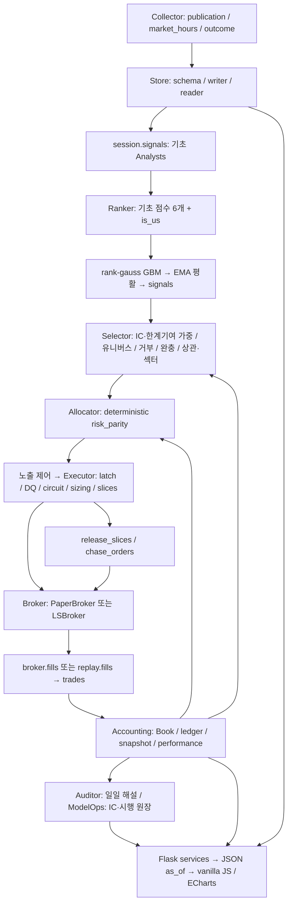

# Repository Audit — Quant Research / Portfolio / Execution Mission Control

기준 커밋: `70ff06a`. 감사일: 2026-09-09. 지정된 17개 문서를 순서대로 읽은 뒤 코드·호출부·테스트·실제 창고를 대조했다.
이는 실자본 운용 인증이 아니다. 아래의 **재현**, **코드 확인**, **기존 실험 기록**, **미검증**을 구분한다.
전략 실험·홀드아웃 개봉·브로커 호출·운영 데이터 정정·배포는 수행하지 않았다. 재현용 주문·체결은 임시 창고와 스텁이다.

## A. Architecture Map — 실제 호출 경로



| 경계 | 실제 구현 | 확인 내용 / 한계 |
|---|---|---|
| 수집 → 저장 | `collectors/publication.py`, `outcome.py`, `store/schema.py`, `writer.py` | 공표 정책·관측시각·provenance, append-only 파일. 스테이징과 manifest 사이 장애/다중 writer 원자성은 별도 위험 |
| 저장 → 분석 | `store/reader.py`, `prices.py`, `session/signals.py` | 일반 표는 observed_at 게이트, 참조 표 3개는 문서화된 valid_from 예외. 가격 보정은 opt-in. 예외 범위를 확대하지 않음 |
| 분석 → Ranker | `analysts/ranker.py`, `tools/train_ranker.py` | **LightGBM objective 문자열은 regression**, 그러나 피처·타깃은 세션×시장 rank-gauss. 원수익률 회귀가 아닌 기존 순위 surrogate. pairwise/listwise 학습으로 오인하지 않음 |
| Ranker → Selector | `selector/{weights,combine,pipeline,candidates}.py` | ranker는 Analyst 하나로 합성. gate 미달은 관찰 가중치 0, 뉴스/SNS는 매수 거부만 |
| Selector → 비중 | `session/daily.py`, `allocator/risk_parity_baseline.py`, `selector/exposure.py` | 후보+기존 보유의 가격을 함께 조회. 현금은 ledger.available_cash에서 옴. 후보 0이면 보유관리도 조기 종료하는 경로는 남음 |
| 비중 → 주문 | `executor/{guards,sizing,orders,pipeline}.py` | 순수 코드. 목표-보유 차액, 정수·ADV·현금 제약. 전송 전 submitting 기록. 후속 slices의 guard 공백 발견 |
| 주문 → 체결 | `broker/fills.py`, `executor/lifecycle.py`, `tools/chase_orders.py` | 실제 재호가 호출 존재: 오래된 문서의 “미배선”은 현재와 다름. 정정 주문 체인 합산, 누적 수량 차분. 누적 대금 차분 결함 발견 |
| 체결 → 장부 | `accounting/{book,ledger,snapshot,nav,performance}.py` | TWR/입출금/FX/수수료·세금 단일 계층. 배당 권리 수량이 평가일 보유에서 오는 결함 발견 |
| 대사 | `tools/{reconcile_fills,reconcile_snapshot,settlement_check}.py` | 주문 대사 + 잔고 보정 + 결제 대조. 최신 대사 PASS가 주문 전제라는 구조는 없음. fallback 가격의 보정 거래는 체결 사실과 구분해야 함 |
| 감시 → 화면 | `dashboard/services/{trading,learning,system,freshness}.py` | IC 감쇠·시스템 경고 존재. 타임머신 계좌 API의 현재 브로커 조회, 실현비중 의미, 하드코딩 WF 수치 문제 |

실제 창고 조회 `2026-09-09T10:17:51Z`:

- `allocator.baseline=risk_parity`, `allocator.rl.checkpoint=""`, `execution.account_mode=paper`.
- `ranker.smoothing_span=5`, `selector.exit_rank=72`, 양 시장 ranker 가중치 `1.0`.
- 저장 IC: KR `0.09900678`, US `0.06092783` (둘 다 9/3 측정 기록을 읽음. 이번 감사의 새 OOS 측정이 아님).
- 모델 사이드카 30개. `execution.max_adv_ratio=1.0`: 모의 단계 설정. 실전 재조임 조건은 문서에만 있어 live 준비 완료로 볼 수 없음.
- 최근 10일 가격 KR 22,396행 / US 39,546행, 두 시장 close≤0·null 각각 0건. 최신 KR 9/9, US 9/8은 기대 세션과 일치.
  **이 창의 이 두 검사만 통과한 것**이며 전체 DQ PASS로 환산하지 않는다.

## B. Postmortem Traceability

과거 수치는 `docs/rl-postmortem.md`의 기록이다. 그 수익률을 이번에 재실행했다고 주장하지 않는다.

| Past Failure | Root Cause / Evidence | Existing Guardrail | Is It Actually Enforced? | Remaining Risk / Improvement Opportunity | Regression Test |
|---|---|---|---|---|---|
| LS RL 반영 0% | ensemble 가중 0/모드, 슬롯·차원 불일치 | set encoder, live 관측, 반영률 | 정책 관측은 ledger 사용. **표의 반영률은 계획에서 계산** | 계획/체결/정책 개입을 구분해야 함 | `allocator/test_env.py`, 이번 무체결/부분체결 회귀 |
| 카나리 통과가 NAV를 못 설명 | 지연 head가 기여 독점, 예산 768 vs 약 110k | 환경·용량·신용 필요조건 3개 | `verify_canary_gate.py` 존재. 필요조건을 성과로 승격하지 않아야 함 | head별 진단 + OOS 비용 후 대조를 유지 | `tests/rl/`, `modelops` 진단 테스트; 장시간 canary는 이번 미실행 |
| 1회차 보상 평평·현금 도피 | EV .82에도 OOS 우위 없음, 시작점 714회 | 평가 도구, warm start, fixed cash, 파일럿 | 코드와 판정 이력 존재 | best checkpoint·단일 seed는 production 근거 부족 | `allocator/test_train.py`, `test_env.py`, 평가 도구 테스트 |
| r5 학습 배관 고장 | FX 1478, value grad 1659 vs policy 19.5 | O(1) 관측, 분리 clipping | env/train 구현·관측 스케일 테스트 존재 | 실데이터 새 칸 추가 시 스케일 분포를 함께 검사 | `allocator/test_env.py`, `test_train.py` |
| r6 외움 | 학습 +.00095, OOS −.00170, 현금 18% | 현금·지연 자유도 제거 | live가 env_overrides를 읽음 | 실행 환경 차이·시드 분산은 별도 검증 | `allocator/test_live.py` |
| 3회차 배분 edge 없음 | 반영률 .95, 검증 −.00005~−.00011 | 파일럿 중단, rule 기본값 | 현재 RL checkpoint 비어 있음 실측 | 재배분 재시도보다 selection 정보원 한계기여 | `allocator` 및 `selector` 기존 테스트 |
| 매매 전반 beta 종목 하나 외움 | 학습 +360~680%, effective N=1, OOS IC 열세 | 비중 투영·잔차 정책·seed ensemble | 실험 코드와 기각 기록. 운용 기본값 아님 | 비현실적 유동성·집중을 성과와 함께 판단 | `tools/trial_e2e_rl.py`, final 실험은 이번 미실행 |
| MSE/IC 목적 불일치 | pooled 변형 실패, rank-gauss GBM만 채택 | 동일 rank_gauss로 학습·추론 | `analysts/ranker.py`, `train_ranker.py` 직접 확인 | artifact usable_from만 믿음; hash·승격 gate 보강 필요 | `analysts/test_ranker.py` |
| gross alpha를 회전이 소멸 | gross +31.7% → net +5.2%, 회전 64~88 | EMA5·exit 72 | 코드·실제 config 모두 확인 | gross/net/cost breakdown과 stress 표준화 필요 | `analysts/test_ranker.py`, selector 완충 테스트 |
| 4회차 ranker 후보에서도 실패 | 검증 −.00004~−.00007, 반영률 .95 | pilot 중단·Champion 유지 | 현재 설정 확인 | ranker 개선 ≠ 24개 내부 배분 edge | 기존 env/live 테스트, OOS 판정은 미재실행 |
| 5회차 final 장치는 정상·edge 부재 | effective N 21~27, Δ −41%p/년, t −2.96 | 사전등록·순IR·실비·3시드·최강 대조 | 도구/기록 존재 | 9/8 재개 조건이 최신. 무조건 종료/무조건 재개 모두 잘못 | 독립 execution 문제와 G1~G6 gate 이후에만 새 연구 |
| 0원/휴장으로 MDD 왜곡 | 동시 −100%가 상관을 지배 | read_prices + price-read/price-adjust 정적 가드 | invariant 111개 통과 | +inf, ghost session, DQ의 null-only 계수 및 stale 공백 | 가격·DQ·executor 회귀 |
| 후보 밖 보유 청산 누락 | 과거 3,109 종목×일 매도 0 | 후보∪보유 가격 조회 | `session/daily.py`에 배선됨 | 고가주 필터가 기존 보유 매도도 막음, 후보 0 경로 별도 | session 보유 청산 + sizing 회귀 |
| 무체결 shadow를 무사고로 인정 | 하루 호출마다 previous_session 소실 | D+1, 거래 없는 평가 미측정 | loop/pending/verify_m3 확인 | planned 기반 반영률이 같은 종류의 거짓 양성 | 무체결/거부/partial 시나리오 |

## C. Quant Research Opportunities

**G1~G6 판정은 기존 등록에 따라 2026-10-01 이후**다. 감사 요구를 새 시행 승인이나 금고 개봉으로 해석하지 않는다.

| Opportunity | Expected Edge | Evidence | Complexity | Risk | Priority |
|---|---|---|---|---|---|
| G1 유동성 고갈·Amihud·거래 단절 | 기존 유동성 “수준” 위 변화 정보 | 등록 coverage KR 96~98%, US 99%; marginal IC 미측정 | 낮음 | 거래정지/0 price 오염 | P1 연구 |
| G2 부실·희석·공시 급증 | event 합성에서 묻힌 원자료 | 등록 coverage 있음; 기존 점수와 겹침 | 중간 | 공표시각·수집 실패를 사건 0으로 오인 | P1 연구 |
| G5 발생액·부도 거리·적자 지속 | 재무 품질 상호작용 | KR 유효 93~95%, US 66~71%; OOS edge 미측정 | 중간 | 오래된 재무·금융업 결측 | P1 연구 |
| G6 실적발표 반응/PEAD | 10-Q보다 빠른 사건 정보 | 시행 J 실패, 8-K 2.02 후속 사전등록 | 중간 | event window가 미래 반응을 읽는 누수 | P2 연구 |
| G3 공매도 / G4 내부자 | 비선형 조건부 한계기여 가능성 | 과거 단독/기존 fundamental 결합 기각; ranker 위는 미측정 | 중간 | 부호 사후 선택·beta 대용 | P2, 등록 순서 준수 |
| regime·breadth·relative strength·sector-relative·momentum quality | 상황별 ranking 개선 | 기존 chart/regime 약함, 섹터 중립화 ΔIC −.0033 기록 | 중간 | 이미 본 표본 반복·참조 섹터 시점 | G1~G6 뒤 새 등록 |
| residual / factor interaction / analyst marginal IC | 기존 ranker가 못 설명한 부분만 채택 | ranker L 채택과 LOO 가중 규칙 | 중간 | 잔차화·모델 선택도 train fold 안에서 해야 함 | 연구 공통 기준 |
| 선형/LightGBM ranking/XGBoost/CatBoost/작은 NN/ensemble | 목적·규제 차이 비교 | 현재 복잡도 증가 edge 증거 없음 | 중~높음 | 다중검정·seed/checkpoint cherry-pick | 후순위 Challenger |
| consensus revisions / sentiment | 새 관측 정보 | 수집 시작 2026-09, 표본 미달 | 중간 | stale·revision 시점·과거 없음 | 관찰만 |
| execution microstructure / RL | 같은 주문의 shortfall·미체결 비용 감소 | TWAP 표본 9/3 시작, 20세션 gate 미충족 | 높음 | bid/ask·book 이력/체결 timestamp 불완전 | TWAP gate 뒤 |

새 정보는 Champion 위 marginal IC, 일별 Δ의 NW t, 최악 블록, 두 시장, 비용 후 성과를 함께 본다.
Gross Alpha → Turnover → Commission → Spread → Slippage → Tax → Net Alpha를 독립적으로 보고한다.
체결가에 포함된 spread/slippage를 수수료처럼 다시 차감하지 않는다. 분해 관측이 없으면 미측정이다.
비용 1/1.5/2/3배, 진입 지연, 유동성 stress는 공통 replay 위에서 사전등록한 Challenger 비교에 붙인다.

## D. Engineering Issues

| ID / 등급 | Hypothesis → Evidence | Change / 검증 계획 |
|---|---|---|
| C1 Critical | 후속 slices가 latch 우회. engage 후 submit 스텁 호출 **1건** | 전송 경계에서 주입 Clock의 현재 latch 재확인; 매도 허용·후속 매수 차단·as_of 회귀 |
| C2 Critical | 같은 날 같은 actor 재발동의 ingest id 충돌. engage→release→engage: **written=0, released** | 전이 시각 단위 id, 동일 명령 replay 멱등성 유지 |
| H1 High | 누적 평균가를 신규 delta에 곱함. 5×100 뒤 누적 10×110 → **1050 ≠ 1100** | 누적 수량과 누적 대금 모두 차분; invalid/역행/초과체결은 UNKNOWN |
| H2 High | 배당락 뒤 매수에도 배당 **84.6**, 기대 **0** | ex-date 이전 체결로 권리 수량 복원; 매도 후에도 권리 보존 |
| H3 High | 실제 IDX key `KR:IDX:KOSPI` vs guard `IDX:KOSPI`. −10%에도 PASS | canonical key, 시장 경계, 설정 임계치 일원화 |
| H4 High | latest data 기준 DQ라 이틀 stale도 PASS. +inf도 read_prices 통과 | 공표 기대 세션과 독립 비교; 유한 양수·missing/ghost를 독립 gate |
| H5 High | sized 비중을 realized로 기록. 체결 **0건 → 반영률 100%** | 실제 holdings/fills와 목표를 구분, 모르는 값은 null; fill 이후 재계측 |
| H6 High | 고가주 매수 필터가 목표 0 청산에도 적용됨 | 신규매수에만 적용, 보유 매도·현금/수수료 상한 회귀 |
| H7 High | `/api/trading/account?as_of=과거`도 현재 broker.fetch | 저장된 관측만 사용; 과거 증거 없으면 미측정, 외부 호출 금지 |
| H8 High | research purpose/금고·예산 공통 차단은 설계, Store 미구현. promote_policy가 gate를 직접 강제하지 않음 | 연구/승격 별도 변경: 자동 승격 금지 상태 유지, 공통 평가 증거 스키마·해시·seed/OOS gate 필요 |
| H9 High | writer manifest 작성 전 중단·동시 append의 원자성 공백(코드 확인, 장애 주입 전) | 단일 writer 운영 의존을 명시. 장애 주입·recovery·동시 제출 검증 필요 |
| H10 High | 대사 실패가 다음 주문을 강제 차단하지 않음. corporate action 가격 조정과 ledger 수량 조정은 별개 | 관측된 broker snapshot·reconciliation 상태·효력 기한의 공통 계약 필요 |
| H11 High (후속 발견) | 기존 셸 테스트의 경로 치환이 worktree에서 0회여도 실제 운영 복구를 실행 | 유일한 cd 명령을 임시 경로로 치환, 0/복수 명령이면 실행 전 실패. 아래 영향 기록·회귀 검증 참조 |
| M1 Medium | purged_folds가 거래세션 horizon을 달력일로 빼고, evaluate는 train fold를 사용하지 않음 | 고정 과거신호 IC 기술통계와 fitted OOS를 구분; session-index purge 회귀 |
| M2 Medium | 학습 화면 WF 성적/학습 임계치 일부 상수. ranker hash 저장하지만 로드시 검증 없음 | 측정 artifact·hash·model age·missing 상태를 명시 |
| M3 Medium | freshness의 entity 조회 실패 시 전체 표 재조회 | 다른 지수/시장으로 신선도 PASS를 만들지 않도록 정확한 entity 유지 |
| M4 Medium | LS HTTP·UI 계좌/시세 경로에서 resource cleanup·예외 내용·live/as_of 경계 확인 필요 | 예외를 알 수 없음으로 드러내고 고객/계좌 비밀은 로그에서 제외 |
| L1 Low | README의 RL 중심 그림·844 passed 배지와 과거 미배선 서술 | 현재 Champion·실행한 검증 범위·남은 위험으로 갱신 |

H8~H10은 별도 계약·장애 시험이 필요한 후속 배치다. H8의 구형 활성화 경로는
아래 후속 배치에서 차단했지만 공통 증거 gate는 미완료다. 임계치 완화나 숫자 보정으로 완료 처리하지 않는다.

## E. UX Issues

1. 최초 화면에 계좌·KPI는 있으나 data/system/model 상태는 여러 탭에 흩어져 있다. 주문 가능성을 하나의 녹색 배지로 합치면
   미측정 대사와 데이터 이상이 숨는다. kill/data/model/reconciliation/pending/next operation을 각각 표시해야 한다.
2. 액션 반영률의 계산은 체결 실현이 아니었다(H5). 원천부터 수정하고, 룰 운용에서도 “RL 관여”라고 읽히지 않게 명명한다.
3. AI 화면의 M4/PPO 중심 상태·과거 WF 상수는 현 Champion의 가치와 다른 질문을 답한다. Training/Validation/OOS/Shadow/Paper/Live와
   IC/marginal IC/순IR/회전/비용/seed dispersion/age를 artifact가 있는 칸만 채우는 비교표가 필요하다.
4. 오늘 성과는 net PnL과 비용 분해가 한눈에 서지 않는다. 관측된 fee/tax와 미측정 spread/slippage를 분리한다.
5. 타임머신 계좌 조회(H7), 미래 데이터도 lag=0이 되는 freshness(M3)는 정상으로 오독될 수 있다.
6. 현재 시트·1px divider·검정 배경·폰트·tabular alignment를 보존한다. 새 이미지·가짜 financial metric은 필요 없다.
   이번 감사의 UX 확인은 HTML/CSS/JS/API 코드 기준이며 전 기기 시각 검수 완료로 표시하지 않는다.

## F. Improvement Roadmap

| 순서 | 배치 | 완료 증거 |
|---|---|---|
| 1 correctness / capital safety | C1·C2, H1·H2·H3·H6 재현 회귀 | 브로커 스텁 호출 수, 장부 대금/권리 수량 exact reconciliation |
| 2 data integrity | H4·H7, 독립 DQ·시점 경계 | stale/holiday/future/zero/nonfinite/cross-market 각각 fail/pass |
| 3 observability | H5, 비용 표시와 첫 화면 의미 정정 | 무체결/partial/reject 구분, 미측정 null, 목표와 실제 원천 분리 |
| 4 operational contracts | H8~H10 | holdout 접근·승격 artifact·writer crash/concurrency·broker 대사 gate의 별도 설계/시험 |
| 5 alpha quality / cost | 등록된 G1~G6 (10/1 이후), stress | 기존 Champion 위 OOS marginal contribution, 순IR, turnover, 비용 민감도 |
| 6 execution quality | TWAP 20세션 1차 gate, 이후 RL Challenger | VWAP 대비 비용·체결률·금액가중/중앙값·OOS 동일 창 |
| 7 UI/UX | first-screen 운영 질문 8개 + Champion 비교 | 실제 payload 기반 desktop/mobile 검수, 거짓 정상 상태 0 |
| 8 performance | existing cache/파싱/추론/replay/aggregation profile | 같은 입력·부하에서 전후 min/median/max와 결과 동등성 |
| 9 cosmetic | 근거 있는 변경만 | 현재는 추가 asset 필요 없음 |

성능 기준선: 실제 가격 좁힌 조회 KR 0.330s / US 0.154s (10일, 1 thread, 512MB, 각 1회).
이는 반복 benchmark가 아니므로 최적화 성과로 주장하지 않는다. 기존 memo·partition pruning·adjust 벡터화는 보존한다.

## 검증 기록

- `uv run pytest tests/invariants/`: **111 passed, 1 warning in 11.07s**, 수정 전.
- 회계/주문/DQ 독립 재현 수치는 D 절. 임시 Store + ReplayClock + PaperBroker spy + fill 응답 스텁, 네트워크 없음.
- 수정 후 실행 명령·출력·남은 위험은 구현 검증 기록에 추가한다. 기존 시험 삭제·gate 완화로 맞추지 않는다.

## 구현 검증 — 첫 배치

전략/모델을 교체하지 않고 재현한 경계만 수정했다. 원래 작업 폴더에서 병행 중인
다른 변경은 유지하고 `fix/mission-control-safety-audit` 격리 worktree에서 작업했다.
운영 데이터 정정, 크론 변경, 주문 전송, 배포는 실행하지 않았다.

| Hypothesis / Evidence | Change | Test | Before → After |
|---|---|---|---|
| C1 계획 뒤 latch가 바뀌면 후속 매수가 나간다 | 전송 Clock 주입, 매 조각 latch 재조회, MemoStore에서 latch 캐시 배제 | `test_safety_boundaries.py`: 지연 조각·조각 사이 발동·외부 writer·매도 허용 | engaged 상태 broker spy 1회 → 0회; 조각 사이 발동 뒤 추가 매수 0회 |
| C2 날짜 단위 멱등 키가 재발동을 삼킨다 | 발동 시각 단위 키 | 같은 날 engage→release→engage, 동일 이벤트 반복 | `released / written=0` → `engaged / written=1`, 같은 이벤트 재호출 0행 |
| H1 누적 평균가가 바뀌면 체결 대금이 틀린다 | 누적 수량·대금 함께 차분, 감소/비유한/초과/무수량 대금 정정은 UNKNOWN | `broker/test_fills.py`, 기존 정정 체인 테스트 | 5×100 후 누적 10×110: 1,050 → **1,100**; 중복 조회 추가 체결 0 |
| H2 평가일 보유가 과거 배당 권리를 바꾼다 | 배당락 이전 시장 지역일 보유를 복원, 미래 발효 체결·배당 제외 | `test_dividend_entitlement.py`, 기존 지급/NAV 회귀 | 배당락 뒤 매수 배당 84.6 → **0**; 배당락 뒤 매도에도 원래 권리 유지 |
| H3 다른 지수 ID를 읽어 급락을 못 본다 | canonical KR ID, KR/US 경계, config 임계치 | 정본 KOSPI −10% | 통과 → **매수 차단** |
| H4 최신 저장일을 기대일로 착각한다 | 공표 기대 세션 비교, 유한 양수 가격, valid_from≤as_of | stale·inf·미래 발효 가격, 기존 가격/회계 테스트 | 이틀 stale PASS → 차단; inf/미래 가격 사용 → 제외 |
| H5 계획을 체결로 오인한다 | 초기 실제 수량 + 해당 세션 실제 체결, 관측 시점의 revision 추가 | `test_realization.py`: broker/replay 식별자·매수/매도·멱등·과거 조회 | 무체결 100% → **0%**; 10주 목표의 5주 체결 → 비중 0.05; 구버전 계획 기록 → **미측정** |
| H6 고가주 규칙이 기존 보유 청산을 막는다 | 매수에만 가격/자본 한도 적용 | 기존 1주·목표 0 청산 | skip → **1주 매도** |
| H6 추가: 현금 검사가 지정가·수수료를 빼먹는다 | 상한 지정가와 Rates 비용을 먼저 예약 | `test_planned_buys_reserve_limit_price_and_commission` | 현금 200,000에 필요 201,030.15 → 계획 총액+비용 **≤200,000** |
| H7/M3 과거 화면이 현재/다른 시장 값을 보여준다 | 과거 계좌 API 외부 호출 금지, freshness 필터 유지, unknown을 정상/critical 0으로 그리지 않음 | `test_temporal_safety.py`, 실제 JS renderer | 현재 잔고 혼입·다른 시장 최신으로 대체 → **미측정**; 모바일 unknown → 확인 필요 |

### 실제 실행 명령과 핵심 출력

Python 3.12. 기존 `.venv`를 사용하되 `PYTHONPATH=.`로 격리 checkout의 코드를 실행했다.
아래의 `python`은 `/home/mintkangaroo/Project/Quant_RL_Trading/.venv/bin/python`이다.
일부 실행의 `OMP_NUM_THREADS=1 MKL_NUM_THREADS=1 QUANT_RL_DUCKDB_THREADS=1`은
동시 검증의 자원 사용을 제한한다. 운용 설정 변경이나 속도 개선 결과로 해석하지 않는다.

```text
# 수정 전
uv run pytest tests/invariants/
111 passed, 1 warning in 11.07s

uv run pytest tests/executor tests/broker tests/accounting tests/session tests/backtest tests/dashboard tests/tools --disable-warnings
596 passed, 229 warnings in 816.44s

# 새 회귀가 기존 코드에서 실패하는지 먼저 확인
python -m pytest tests/executor/test_safety_boundaries.py tests/accounting/test_dividend_entitlement.py tests/broker/test_fills.py --tb=short
14 failed, 12 passed
# 추가 현금 예약 / 미래 발효 가격 회귀도 각각 수정 전 1 failed

# 수정 후 확장 검증
python -m pytest tests/invariants tests/store tests/executor tests/broker tests/accounting tests/dashboard/test_temporal_safety.py tests/dashboard/test_trading_render.py tests/dashboard/test_tab_render.py tests/dashboard/test_mobile_layout.py tests/auditor/test_daily_review.py --disable-warnings --tb=short
459 passed, 3 skipped, 7 warnings in 66.52s

# 추가 US 배당 시점 및 누적 체결 역행을 포함한 집중 검증
python -m pytest tests/accounting/test_dividend_entitlement.py tests/broker/test_fills.py tests/executor/test_safety_boundaries.py tests/executor/test_realization.py tests/dashboard/test_temporal_safety.py --disable-warnings --tb=short
42 passed, 7 warnings in 14.87s

# 미측정의 KPI/리스크 행 표시를 포함한 최종 JS 렌더링
python -m pytest tests/dashboard/test_trading_render.py tests/dashboard/test_tab_render.py tests/dashboard/test_mobile_layout.py --disable-warnings --tb=short
29 passed in 2.23s

# 세션 / replay / live 관측 / API 통합
python -m pytest tests/invariants tests/session tests/backtest tests/allocator/test_live.py tests/store/test_schema_evolution.py tests/dashboard/test_trading_api.py tests/dashboard/test_temporal_safety.py tests/tools/test_run_session_exit.py --disable-warnings --tb=short
183 passed, 229 warnings in 561.59s

git diff --check
# 출력 없음, rc=0
```

스위트가 겹치므로 숫자를 더해 전체 고유 테스트 수라고 주장하지 않는다. 3개 skip은
기존 기업행위 실데이터 검사의 자료 부족이다. 격리 worktree에는 기존 호가단위 검사가
읽는 실제 가격 8/12·13·14와 universe 8/14 파티션만 복사했다. 최초 실행의 경로 결측
3건을 자료 복사로 해결했으며 검사 삭제·skip 추가로 넘기지 않았다. 전체 기업행위
실데이터 검증 PASS를 주장하지 않는다. 경고는 기존 exchange_calendars/NumPy 의존성 경고다.

새 가격 상한을 구현할 때 `until`의 배타적 경계를 `as_of`에 그대로 적용해 7개 회귀가
실패했다. Store의 기존 계약을 바꾸지 않고 가격의 `valid_from <= as_of`를 별도로
적용해 해결했다. 기존 스냅샷·당일 가격 테스트는 그대로 유지했다.

정적 검사도 전체 실행했다. 병행 작업의 영향을 피하기 위해 `git archive 70ff06a`의
깨끗한 사본을 비교 기준으로 사용했다.

| 검사 | 기준 커밋 | 이번 checkout | 추가 진단 |
|---|---:|---:|---:|
| `ruff check .` | 1,632 오류 | 1,632 오류 | 0 |
| `mypy` | 430 오류 / 120 파일 | 430 오류 / 120 파일 | 0 |

**전체 정적 검사는 실패 상태다.** 오류를 ignore하거나 CI 규칙을 낮추지 않았다.
Ruff는 파일·규칙·해당 소스 행, mypy는 파일·진단 메시지 기준으로 추가 진단 0건을
비교했다. 새 realization 모듈과 새 테스트 파일의 Ruff 검사는 별도로 통과했다.

### 남아 있는 승인·운용 조건

- C1은 각 전송 경계에서 확인한다. 이미 브로커가 받은 주문의 취소, 확인 직후의 경쟁,
  프로세스 간 제출 원자성은 H9/H10의 작업이다. 킬스위치를 거래소의 원자적 차단으로 표현하지 않는다.
- H4는 부분 완료다. ghost/leading/trailing missing의 독립 DQ gate, 기업행위 배율,
  stale FX/fundamentals/consensus 검증이 남았다. coverage 비율 하나로 전체 PASS하지 않는다.
- H5는 같은 세션 주문에 귀속 가능한 체결을 측정한다. 구버전 계획 행은 복구하지 않는다.
  기업행위·수동 정정·7일 이상 지난 주문과 목표의 귀속은 미해결이다. 이것은 정책의
  marginal contribution이나 OOS 성과 측정이 아니다.
- H7은 과거 계좌 혼입을 차단했다. 현재 계좌 조회를 provenance 있는 broker snapshot
  수집으로 바꾸고 최신 대사 결과를 주문 전제 조건으로 강제하는 일은 H10에 남았다.
- H8/H9/H10, 기존 Ruff/mypy 부채는 후속 배치다. reconciliation 불일치·진짜 주문가능금액·
  미결 주문 예약금·기업행위 수량이 해결되기 전에는 **실자본 운용 준비 완료가 아니다**.
- 새 circuit 설정은 명시적 발효 시각으로 등록해야 한다. 키가 없는 과거 구간의 replay는
  버전별 설정을 별도로 준비해야 한다. 코드에 숨은 fallback을 넣거나 운영 창고를 소급 수정하지 않았다.
- 이번 배치는 새 알파, OOS 개선, 거래비용 감소, 학습/백테스트 속도 향상을 실증한 작업이 아니다.
  다음 연구는 등록된 날짜·예산 안에서 marginal IC와 비용 후 성과로 판정한다.

### 최종 반복 검증

커밋 준비 중 별도로 반복한 같은 통합 명령(`--durations=8`, thread 제한 포함)도
**183 passed, 229 warnings in 946.10s**로 종료했다. 두 달 replay를 반복하는
`test_cash_never_goes_negative` 181.09s, `test_leverage_never_exceeds_one` 201.42s,
`test_the_run_actually_traded` 202.45s가 검증 시간의 약 62%를 차지했다.
이는 테스트 소요 시간 측정이며 production 성능 최적화 결과가 아니다.
중복으로 시작한 별도의 경계/레버리지 후속 실행은 전체 통합 통과를 확인한 뒤
중단했으며 통과 건수에 포함하지 않았다.

기업행위 skip 사유도 재확인했다: `test_corporate_actions.py -rs`는
**18 passed, 3 skipped**다. 2개는 `adj_factor` 자료 미수집, 1개는 격리 창고의
`KR:150840` 자료 부재다. 해당 데이터 gate를 낮추지 않았다.

## 후속 배치 — 데이터 대기 중 가능한 H8 안전 조치

기준 커밋 `8db7ac6`. 같은 격리 브랜치에서 작업했다. 아래 테스트 격리 사고로
원래 작업 폴더의 서비스 재기동과 shadow NAV 정정이 발생했다. 의도한 배포/운영 변경은 아니며,
영향을 없었던 것으로 처리하지 않는다.
설계 §13을 먼저 갱신한 뒤 임시 Store와 스텁으로 실패를 재현했다.

| Hypothesis | Evidence | Change | Regression / Before → After |
|---|---|---|---|
| 구형 도구가 충분한 증거 없이 승격을 허용한다 | `generalizes`와 반영률만 확인. `--window valid`도 rc=0; 실제 checkpoint 해시·Champion 순성과·seed 안정성 증거 없음 | 구형 gate는 명시적 "승격 미지원"과 rc=2. 새 평가 실행이나 저장된 OOS 조회 없음 | 좋은 기존 `oos`/`valid` 기록 모두 rc **0 → 2**. 이는 수익성 재평가가 아님 |
| CLI를 건너뛰면 설정을 바꿀 수 있다 | `write_config`를 직접 호출하면 평가 없이 paper/shadow/live 활성화 | 비어 있지 않은 checkpoint는 CLI와 쓰기 함수 양쪽에서 거부 | 4개 모드 조합에서 활성화 **허용 → 거부**, config 변화 없음 |
| 차단 때문에 비상 해제나 읽기 전용 점검도 잃을 수 있다 | 기존 `--off`·`--dry-run` 경로 대조 | 해제의 append-only 정정과 dry-run 유지, 서로 충돌하는 옵션은 오류 | 과거 as_of 정책 보존, 현재 해제 확인; dry-run에서 설정 쓰기 없음 |
| 재부팅/로그 유실이 종료한 실험을 재개시킨다 | supervisor가 완료 표식 부재를 근거로 8/30 외부 체인과 r7을 다시 띄움 | 3개 구형 체인은 작업 전에 rc=2; supervisor의 3회차 재시작 제거 | 격리 셸 실행에서 로그·작업 생성 없음; 완료 표식 유무 양쪽에서 재시작 0회 |

첫 회귀 실행(구현 전):

```text
python -m pytest tests/tools/test_policy_promotion_safety.py --tb=short --disable-warnings
8 failed, 3 passed, 1 warning in 6.43s
```

구현 후 같은 11개: **11 passed, 1 warning in 6.15s**. 이후 셸 경계 시험을 추가했다.
아래 명령은 앞 절과 같은 Python 3.12, `PYTHONPATH=.` 및 thread 제한으로 실행했다.

```text
python -m pytest tests/tools/test_policy_promotion_safety.py tests/invariants \
  tests/tools/test_run_session_exit.py tests/allocator/test_live.py \
  tests/store/test_config.py --disable-warnings --tb=short
147 passed, 4 warnings in 64.74s
```

**남은 위험:** 이 조치는 기존의 불충분한 승인 경로를 닫은 것이다. 공통 연구 접근 통제,
새 증거 스키마·파일 해시 연결·여러 seed·Champion 대비 비용 후 성과·사람 승인 연결은
아직 구현되지 않았다. 원시 config 작성 권한이나 다른 연구 도구의 직접 실행을 통제하지
않으며, 이미 실행 중인 정책/작업을 소급해 해제하지 않는다. 기존 Champion이나 연구
평가일을 변경하지 않았다. G1~G6는 10/1 이후, TWAP은 유효 20거래일 관측 이후 판정한다.

### 검증 중 발견한 High: 셸 테스트가 worktree를 벗어남

`test_reboot_recover_script.py`와 `test_collect_daily_script.py`는 현재 checkout 경로의
문자열 치환으로 `cd`를 격리했다. 실제 스크립트에는 원래 저장소 절대경로가 하드코딩돼
있어서 격리 worktree에서는 치환이 0회여도 실제 셸을 실행했다.

추가 검증 중 복구 테스트가 이 경로를 호출했다. 해당 pytest와 그 자식 프로세스만
중단했다. 테스트 고정 시각 이름의 로그에서 대시보드 재기동 호출 3회와 회계 완료 2회를
확인했고, 회계 로그에는 shadow NAV 정정 1회와 나머지 변화 없음이 기록됐다.
복구 계획은 수집·세션 모두 OK였고 추가 수집/주문 세션은 호출하지 않았다.
테스트의 curl은 스텁이어서 워밍업 API는 호출하지 않았다. 중단 뒤 비어 있던 표준
paper 대시보드 포트 5059는 기존 작업 폴더의 기존 실행 방식으로 복구했다.
append-only NAV 정정과 사고 로그는 삭제하거나 숨기지 않았다.

수정 계약: 테스트가 checkout 이름을 추측하지 않고 유일한 `cd` 명령을 임시 경로로
치환한다. 명령이 없거나 여러 개면 **셸 실행 전에 실패**해야 한다. 스텁 이외의 실제
복구·수집 도구를 실행하지 않은 호출 기록을 검증한다. 운영 셸 자체의 경로는 변경하지 않는다.

수정 후 수집·복구 셸 및 승격 시험 **28 passed, 1 warning in 8.32s**.
경로 모호성 4개 회귀를 추가한 최종 실행:

```text
python -m pytest tests/tools/test_policy_promotion_safety.py \
  tests/tools/test_reboot_recover_script.py tests/tools/test_collect_daily_script.py \
  tests/invariants --disable-warnings --tb=short
143 passed, 1 warning in 26.72s
```

변경한 Python 5개 파일 `ruff check`: **All checks passed!**.
변경한 셸 4개 `bash -n` 및 `git diff --check`: **rc=0**.
대시보드 복구 확인은 `GET /trading` HTML **HTTP 200**으로 했으며, 금융 API는 호출하지 않았다.
저장된 shadow NAV는 `Store.get(..., as_of=LiveClock().now())`로 당일 정정의
`source=accounting`, `revision=1`을 확인했다. 포트 복구와 NAV 기록의 존재 확인은
해당 정정의 경제적 정확성을 새로 인증한 것이 아니다.
