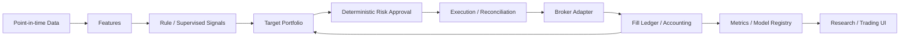

# Quant Trading Platform 감사 — 2026-09-09

대상 기준 커밋: `70ff06a`. **분석·문서화 단계이며 엔진 수정이나 Production 승인을 수행하지 않았다.**

> 후속 구현: 감사 당시의 아래 판정은 역사 기록으로 보존한다. 주문 안전성 패치의 구현 범위·검증·미완료 경계는 [execution-safety.md](design/execution-safety.md)와 [README 진행 상태](../README.md#개선-진행--주문-안전성)에 기록한다. 감사의 제안 전체가 해결된 것은 아니다.

가장 먼저 [rl-postmortem.md](rl-postmortem.md)를 끝까지 읽었다. 이후 전체 추적 파일 목록, 실행 진입점, 핵심 거래·학습·데이터 경로와 관련 테스트를 조사했다. 673개 추적 파일 중 Python 패키지는 182개 파일·49,974줄, 테스트 Python 파일은 170개다. 모든 파일을 줄 단위로 검증했다는 의미는 아니다. 계좌 주문·배포·새 모델 학습·홀드아웃 성과 재평가는 실행하지 않았다. 재현 실험은 임시 창고와 가짜 브로커에서 수행했다.

판정 표기:

- **재현:** 현재 함수를 실행하여 해당 경계의 실패를 확인했다.
- **코드 확인:** 호출 경로와 구현으로 확인했다. 실제 사고 발생 횟수·금전 손실은 추정하지 않는다.
- **과거 기록:** 문서/기존 산출물의 수치다. 이번에 전략 성과를 재측정한 결과가 아니다.
- **미확인:** 자료가 부족하거나 추가 실험이 필요하다.

## 현재 판단

**현재 근거로 배분·매매 전반 RL을 기본 운용으로 복귀시킬 이유는 없다.** 감독학습 랭커는 유지할 연구 가치가 있지만, IC 개선만으로 비용 후 수익성이나 실전 적합성이 증명되지는 않았다. 우선 구조는 **E. Hybrid Architecture: 감독학습 점수 + 규칙 기반 포트폴리오 + 결정론적 리스크 + 집행**이다. 동일 조건의 baseline 비교 뒤 최종 확정한다.

현재 창고의 설정을 읽어 확인한 값:

| 설정 | 값 | 의미 |
|---|---|---|
| `allocator.baseline` | `risk_parity` | 룰 배분 기본값 |
| `allocator.rl.checkpoint` | 빈 문자열 | 운용 RL 비활성 |
| `allocator.rl.modes` | `paper` | 정책 경로를 설정하더라도 대상 모드는 모의 |
| `ranker.smoothing_span` | 5 | EMA5 평활 |
| `selector.exit_rank` | 72 | 보유 완충 |
| `execution.live_trading` / `account_mode` | `true` / `paper` | 모의계좌에 실제 주문을 전송하는 설정. 실전 승인과 다르다 |
| `research.holdout.start` | 2026-07-01 | 일부가 이미 RL OOS 평가에 사용됨. 미사용 구간으로 간주할 수 없음 |

## Postmortem 전체 분해

아래 수치는 모두 원문에 기록된 과거 결과다. 지금 찾은 결함을 과거 모든 실패의 원인으로 소급 단정하지 않는다.

| Failure symptom | Immediate cause | Root cause | Architectural cause | Quantitative consequence | 재발 방지 constraint | 필요한 regression test |
|---|---|---|---|---|---|---|
| 오라클 카나리 통과에도 NAV 개선 불명확 | 합산 그래디언트가 지연 머리 반응을 비중 학습으로 오인; 학습 예산 부족 | 대리 지표와 필요한 검정력의 오판 | 진단 게이트가 헤드별 행동·경제적 결과를 연결하지 않음 | 기여도 11.9배지만 NAV 차이 부호 반복 반전; 필요 약 11만 스텝 대 768 | 헤드별 귀속 + 인과 행동 반응 + NAV 대조; 신호 세기 기반 예산 | head attribution 분리, oracle dose-response, insufficient-budget 판정 |
| M4 1회차 보상 평평·현금 증가 | 행동 비용 회피, 같은 에피소드 시작 반복 | 선택 알파와 노출 타이밍을 분리하지 않은 학습·판정 | 현금 자유도와 사후 OOS 평가에 의존 | 20M 스텝·38.6시간; reward −0.017; 현금 6.5→13.8%; EV +0.82 | 선택/노출/비용 분해, 무작위 시작, 학습 중 검증, 정책 변화 측정 | fixed-cash, episode diversity, checkpoint validation, EV만으로 통과 금지 |
| r5 정책 학습 정지 | 가치 그래디언트가 전역 클리핑 예산 소모 | 환율·보유일 등 관측 단위 불균형 | 공통 인코더/클리핑 + 현실 스케일을 담지 못한 테스트 | 가치 norm 1,659 대 정책 19.5; 실효 정책 LR 약 3e-9 | feature 단위·범위 계약, 정책/가치 분리 클리핑, 실데이터 분포 점검 | 기존 O(1) 관측·분리 클리핑 테스트 유지, 실데이터 분위수 경계 추가 |
| r6 학습 개선·OOS 악화 | 초기 현금 진입 타이밍을 외움 | 반복 구간에서 불필요한 행동 자유도에 과적합 | 배분 정책에 현금·지연 책임까지 부여 | 학습 +0.00095/일 대 OOS −0.0017; 현금 18% 대 균등 7%; 비용 차이 설명 7% | warm start, 현금/지연 규칙화, 독립 검증 | 초기 상태별 성과, cash-fixed, 지연 제거, OOS 분리 |
| r6 학습 처리량 급락 | LRU 부족·반복 config 조회·캐시 미예열 | 캐시 크기와 작업 집합 불일치 | 세션 데이터와 정책 상태의 캐시 경계·계측 부족 | 예상 33시간 작업이 12일 페이스 | 데이터 지문별 캐시, 충분한 LRU, 예열, 단계별 시간/RSS | 파일 파싱 횟수, 캐시 무효화, 동등 결과 확인 후 처리량 비교 |
| 3회차 제어 가능하지만 균등가중 못 이김 | 후보 24 안의 비중 변경이 추가 수익을 만들지 못함 | 해당 입력·표본에서 배분 알파 증거 부족 | 선정 알파와 배분 알파를 같은 문제로 취급 | 검증 우위 −0.00005~−0.00011, 반영률 0.95 | 강한 대조군과 파일럿 중단; 반영률은 성과의 필요조건일 뿐 | reflected-but-unprofitable 정책 승격 거부 |
| 매매 전반 베타가 종목 하나에 집중 | 유니버스 softmax의 승자 집중 | 구조적 분산 제약 부족·훈련창 외움 | 선정·배분·회전을 단일 목적에서 최적화 | 학습 +360~680%, 유효종목 1; OOS IC 0.043 대 0.081, 최악 −0.186 | 단일 비중 상한·유효종목 하한·유동성/상한가 제약 | concentration cap, effective-N, limit-lock fills, seed별 결과 |
| 랭커 변형들이 IC 경쟁에서 실패 | 수익률 z에 MSE 적용, 꼬리 영향 큼 | 학습 목표와 순위 평가의 불일치 | 목적함수·타깃·선택 KPI 계약 미흡 | 치팅 결합도 IC 0.054 < 0.076; rank-gauss GBM 전환 후 KR ΔIC +0.028, US +0.031 | 학습 목표와 평가 연결; 비용 후 성과는 별도 검정 | 타깃 정의, PIT feature parity, fold isolation, IC/net KPI 분리 |
| 좋은 순위가 높은 회전으로 소진 | 순위가 매일 흔들려 종목 교체 | 신호의 IC만 보고 거래 비용 영향을 늦게 평가 | 신호 안정화·포트폴리오 유지 규칙 검증 부족 | 비용 전 연 +31.7% → 후 +5.2%; 연회전 64~88 | turnover·gross/net·비용 스트레스 필수, EMA/완충 대조 | flat-price cost ledger, smoothing causality, turnover/cost stress |
| 4회차 ranker 후보로 바꿔도 실패 | 더 좋은 후보가 비중 최적화 여지를 보장하지 않음 | 선정 개선과 배분 개선을 혼동 | 추가 모델의 한계기여 검정 부족 | 검증 우위 −0.00004~−0.00007, 학습 +0.0003, 반영률 0.95 | 후보·포트폴리오 대조군 고정, 추가 책임별 성과 검정 | 후보 균등 대비 검증, no-value promotion block |
| 5회차 장치는 작동했지만 성과 열위 | 대조군보다 2~3배 회전하며 비용 지출 | 해당 실험에서 ranker를 벗어날 유익한 신호를 찾지 못함 | 규칙이 해결한 유지 결정을 다시 학습 책임으로 부여 | Δ −41%p/년, NW t −2.96; MDD −25.0% 대 −14.7%; 학습 IR −0.2~+0.04 | 운용 기본값은 룰, 재개에는 새 정보·실행 개선 근거·사전등록 | net OOS·MDD·최악 블록·회전·seed 전체 승격 게이트 |

**문서로 확인되지 않은 사항:** seed별 분산이 실패의 주원인이었다는 결론, 실제 live/paper 성과 차이의 크기, BUY/SELL/HOLD 3분류 편향, 일반 학습 피처로의 의도치 않은 미래수익 주입은 원문만으로 입증되지 않는다. 오라클 누수는 배관 점검용 의도적 장치다. 현재 코드에서 발견한 시간 누수는 아래 별도 이슈다. 반면 현금 편향·단일 종목 집중·과적합·회전 비용 문제는 기록으로 확인된다. 2026-09-08 개정에 따라 RL은 영구 금지나 횟수 제한이 아니라 기본값 제외·조건부 재개다.

## Failure → Constraint → Code → Test matrix

`Code Change`는 **제안**이며 이 커밋에 구현된 변경이 아니다.

| Postmortem Failure | Root Cause | Existing Code Location | New Constraint | Code Change | Validation Test |
|---|---|---|---|---|---|
| 카나리 오판 | 합산 대리 지표·부족한 예산 | `modelops/diagnostics.py`, `tools/verify_oracle_canary.py`, `tests/rl/test_oracle_canary.py` | 헤드별 반응·NAV·예산 모두 확인 | 게이트 산출물에 head/행동/검정력 명시 | `test_canary_requires_economic_response` |
| 보상·현금 도망 | 비용 회피와 선택/노출 혼합 | `allocator/reward.py:191`, `allocator/env.py:556`, `tools/watch_overfit.py` | net 수익과 별도 penalty를 명시적으로 대사 | 중복 실비 차감 제거, 원시 KPI와 학습 보상 분리 | `test_reward_matches_net_pnl` |
| 관측 스케일 | 현실값에 취약한 단위 설계 | `allocator/env.py:1087`, `allocator/train.py:330`, `tests/allocator/test_env.py:516` | O(1)·finite·train/live 동일 변환 | 수정된 스케일·클리핑 유지, 데이터 분포 검사 보강 | 기존 스케일·클리핑 테스트 + 실데이터 검증 |
| 외운 현금 타이밍 | 과도한 책임·같은 구간 반복 | `allocator/env.py:672`, `allocator/live.py`, `tools/select_checkpoint.py` | 기본 운용 RL 비활성, 검증 폴드만으로 선택 | cash-fixed·warm start 유지, 연구용 metadata 검증 | `test_train_test_isolation`, `test_checkpoint_selection_uses_validation_only` |
| 캐시 비용 폭증 | 작업 집합·캐시 설계 불일치 | `allocator/cache.py`, `store/memo.py`, `tests/allocator/test_rl_cache.py` | 지문 정확성 유지하며 반복 I/O 제한 | 프로파일 기반 LRU/배치·예열 개선 | cache parity·무효화·파싱 횟수 |
| 3·4회차 추가 알파 없음 | 선정 알파 ≠ 배분 알파 | `allocator/baseline.py`, `tools/evaluate_policy.py`, `tools/promotion_gate.py` | 현행 대조군보다 net OOS 개선 | reward/균등만 보는 승격 기준 확대 | `test_no_value_challenger_rejected` |
| 한 종목 외움 | 제약 없는 softmax | `tools/trial_e2e_rl.py`, `tools/trial_e2e_final.py`, `portfolio/constraints.py` | 명목 비중과 위험 기여 모두 제한 | 투영 후 독립 재검사, 불가능하면 승인 거절 | `test_position_limit`, `test_effective_n_floor` |
| 랭커 목표 불일치 | 수익률 크기와 순위 평가 혼동 | `analysts/ranker.py:71`, `tools/train_ranker.py:80` | 당시 유니버스에서 feature 변환, 이후 label 결합 | rank-gauss는 유지하되 미래 label 존재 여부와 X 분리 | `test_backtest_live_feature_parity` |
| 회전이 알파 소진 | 매일 흔들리는 순위 | `analysts/ranker.py:240`, `selector/candidates.py`, `tools/trial_selection_smoothing.py` | EMA는 과거 점수만, 교체는 비용 후 한계가치로 | 현행 EMA5/완충 유지, 비용 세분화·스트레스 연결 | `test_transaction_cost_applied`, `test_slippage_applied` |
| 마지막 DRL 대조군 열위 | 규칙 대비 학습 한계기여 없음 | `tools/trial_e2e_final.py`, `docs/protocols/e2e-drl-final-2026-09.md` | 새 정보/집행 개선 근거 전에는 운용 미투입 | 재개 조건과 champion/challenger 기록 강제 | seed·최악 블록·MDD·cost sensitivity 승격 검사 |

위 표의 패키지 상대 경로는 모두 `quant_rl_trading/` 아래다(`tools/`, `tests/`, `docs/`로 시작하는 경로 제외).

## Repository 구조와 유지할 자산

| 영역 | 현재 위치·진입점 | 감사 판단 |
|---|---|---|
| 실행 | `tools/run_daily.py`, `run_session.py`, `run_backtest.py`, `train_ranker.py`, `train_rl.py`, `dashboard.py` | 연구·운용·UI 진입점 존재. 실주문 CLI를 이번 감사에서 실행하지 않음 |
| 수집 | `quant_rl_trading/collectors/`, `tools/collect_*`, `scripts/collect_daily.sh` | LS, KRX, DART, EDGAR, FINRA 등. 달력·공표시각·기업행위 코드 있음 |
| 데이터 저장 | `store/{reader,writer,schema,tables,prices,overlay}.py`, `data/` | Parquet + in-memory DuckDB 조회, 이중시간·revision·오버레이. 원자적 복수 프로세스 쓰기와 참조 예외 검토 필요 |
| 피처·신호 | `analysts/{base,chart,event,fundamental,flow_kr,flow_us,regime,risk,ranker}.py`, `session/signals.py` | 공통 정규화·feature hash·IC·점수. train/live 유니버스 불일치 발견 |
| 전략·선정 | `selector/{pipeline,candidates,combine,weights,constraints,exposure}.py` | 알파 조합·상관/업종 제약·완충·노출 제어. 독립 전략 baseline 목록은 부족 |
| ML/RL | `analysts/ranker.py`, `allocator/{env,policy,train,live,reward,cache}.py`, `modelops/` | GBM은 rank-gauss 타깃 회귀. PPO는 target weights/현금/지연. 현재 3분류 매수·매도 모델이 아님 |
| 포트폴리오·사이징 | `allocator/{baseline,risk_parity_baseline}.py`, `portfolio/`, `executor/sizing.py` | 실제 현금·ADV·lot·FX 처리와 팩터 공분산 존재. 위험 기여 상한은 명목 비중 상한을 대체하지 못함 |
| 리스크 | `executor/guards.py`, `selector/constraints.py`, `portfolio/{constraints,risk_state}.py` | 결정론적 가드가 이미 있으나 전송 직전 단일 승인 계층은 부족 |
| 집행·브로커 | `executor/{pipeline,orders,lifecycle,supervise}.py`, `broker/`, `tools/{release_slices,chase_orders,reconcile_fills}.py` | 멱등 기록·부분체결·정정·취소·대사 구현 있음. 후속 경로와 불확실한 상태 처리가 핵심 위험 |
| 백테스트·모의 | `backtest/`, `replay/`, `scripts/{run_paper,run_shadow}.sh` | 일별 루프는 `session.daily` 재사용. RL 환경의 주문/가드 경로와 동일하지는 않음 |
| 회계·분석 | `accounting/{book,ledger,nav,snapshot,performance,benchmark,rates}.py`, `auditor/` | NAV·TWR·입출금·통화·수수료 중앙화는 유지. 구간 KPI 시작점과 reward 대사는 별도 수정 필요 |
| 설정·시크릿 | `config/`, `store/config.py`, `.env.example`, `settings.py` | 실제 `.env`는 추적되지 않음. 키 원문은 출력하지 않음. 전체 git 이력의 secret scan은 미수행 |
| 로그·모니터링 | `replay/events.py`, `rl_updates`, `rl_evaluations`, `research_trials`, `logs/`, `scripts/health_watch.sh` | 실제 관측 기록 기반. 운영 로그를 알파 검증 산출물로 대체하면 안 됨 |
| UI | `dashboard/app.py`, `api/`, `services/`, `templates/`, `static/` | Flask + ECharts, dark·tabular-nums·테이블·모드 표시 존재. Research 실행/공통 모델 성적표 확장 필요 |
| 테스트·배포 | `tests/`, `.github/workflows/ci.yml`, `scripts/`, `docs/runbook.md` | CI는 lint/type/invariants. 금융·집행 전체 미포함, RL 의존성 선언 누락, 로컬 절대 경로·런북 드리프트 |

전면 디렉터리 재배치가 먼저가 아니다. 예를 들어 `analysts/ic.py:197`이 `dashboard.services.data_quality`에서 조회 유틸리티를 가져오는 역방향 의존만 공용 데이터 계층으로 옮기고, 기존 외부 호출 계약은 보존한다.

## Critical / High / Medium 이슈 매핑

Critical은 잘못된 주문 또는 검증 근거 자체의 무효화를 뜻한다. High는 핵심 계산·상태·검증 게이트 오류다. 아래 **전 항목은 이 감사 커밋에서 미수정**이다. 제안 테스트 이름도 아직 추가된 테스트를 뜻하지 않는다.

| Failure | Root Cause | Code Location | Proposed Fix | Regression Test | Priority |
|---|---|---|---|---|---|
| 후속 분할 매수가 킬스위치를 우회 **[재현]** | 처음 계획할 때만 검사, `submit_orders`는 직접 전송 | [release_slices.py:154](../tools/release_slices.py#L154), [pipeline.py:298](../quant_rl_trading/executor/pipeline.py#L298) | 현재 실행 시각의 중앙 pre-trade 승인·잔여 주문 차단/취소; 매도 허용 정책은 명시 | `test_kill_switch_blocks_released_slices` | **Critical** |
| 미래의 거래 부재가 과거 상폐 정보가 됨 **[재현]** | 10세션 뒤 추정을 마지막 봉의 `observed_at`으로 소급 | [us_universe_panel.py:113](../quant_rl_trading/collectors/us_universe_panel.py#L113) | 추정/확정 분리; 알 수 있었던 시각 보존; 영향받은 데이터·산출물 재검증 | `test_delisting_not_visible_before_inference` | **Critical** |
| RL reward 실비 중복 **[재현·호출 경로 확인]** | 이미 비용 포함된 NAV return에서 `cost` 재차 차감 | [env.py:581](../quant_rl_trading/allocator/env.py#L581), [env.py:841](../quant_rl_trading/allocator/env.py#L841), [reward.py:233](../quant_rl_trading/allocator/reward.py#L233) | 실비는 1회, 별도 shaping은 이름·계수·단위 명시 | `test_reward_matches_net_pnl` | **High** |
| 체결 0건인데 반영률 100% **[재현]** | `Sized.realized_weight`는 예상 체결 후 보유; 장부 확인 전 저장 | [sizing.py:176](../quant_rl_trading/executor/sizing.py#L176), [pipeline.py:413](../quant_rl_trading/executor/pipeline.py#L413), [live.py](../quant_rl_trading/allocator/live.py) | intended/sized/submitted/filled 구분; 체결·대사 장부로 realized 산출 | `test_unfilled_order_does_not_change_realized_weight` | **High** |
| 48시간 전 시세도 품질 통과 **[재현]** | 조회 안의 최댓값끼리 coverage만 비교, 기대 세션 부재 | [guards.py:156](../quant_rl_trading/executor/guards.py#L156) | 거래소 세션·공표 지연으로 freshness 판정; 개별 종목도 차단 | `test_stale_market_data_blocked` | **High** |
| 같은 ID의 동시 브로커 호출 2건 **[어댑터 단독 재현]** | lock이 cache 조회/기록만 보호; 요청 사이 경쟁 | [ls_order.py:160](../quant_rl_trading/broker/ls_order.py#L160), [writer.py:59](../quant_rl_trading/store/writer.py#L59) | 주문별 in-flight claim; 프로세스간 원자 예약·복구·미확정 대사 | `test_concurrent_duplicate_order_claim` | **High** |
| 위험 한도 미달성에도 포트폴리오 반환 **[재현]** | best-effort 투영 뒤 승인 검사 없음; RC와 명목 한도 혼동 | [constraints.py:95](../quant_rl_trading/portfolio/constraints.py#L95), [risk_parity_baseline.py:150](../quant_rl_trading/allocator/risk_parity_baseline.py#L150) | 전체 제약 재검사; 불가능하면 차단/명시적 현금 축소; 명목 cap 별도 | `test_infeasible_risk_limits_rejected`, `test_position_limit` | **High** |
| 첫 평가일 손실이 수익·MDD에서 빠짐 **[계산 재현·loop 확인]** | warmup 뒤에도 첫날을 기초값으로 간주하고 return 제거 | [loop.py:388](../quant_rl_trading/backtest/loop.py#L388), [stats.py:133](../quant_rl_trading/backtest/stats.py#L133) | 평가 직전 index와 첫 평가일 return 포함, 구간 경계 통일 | `test_first_scored_day_included` | **High** |
| 학습 X가 미래 라벨의 존재 여부에 영향받음 **[build_frame 재현]** | label inner join 후 횡단면 feature rank-gauss | [train_ranker.py:80](../tools/train_ranker.py#L80), [ranker.py:221](../quant_rl_trading/analysts/ranker.py#L221) | 당시 전체 eligible universe에서 X 변환·고정 후 y 결합 | `test_labels_do_not_change_feature_normalization` | **High** |
| 참조 데이터가 관측시각 게이트를 우회 **[재현·의도된 예외 확인]** | 업종·float를 예측 정보가 아니라고 간주; 투자 비중에는 영향 있음 | [reader.py:190](../quant_rl_trading/store/reader.py#L190), [tables.py:390](../quant_rl_trading/store/tables.py#L390), [trial_float_cap.py:58](../tools/trial_float_cap.py#L58) | 확인 가능한 역사 이력/PIT로 대체; 근사 자료의 결과는 승격 근거에서 분리 | `test_reference_inputs_are_point_in_time` | **High** |
| RL 학습·백테스트·모의 체결 계약 차이 **[코드 확인]** | RL은 직접 sizing→시장가 대기열; 운용은 지정가·가드·분할·재호가 | [env.py:737](../quant_rl_trading/allocator/env.py#L737), [pipeline.py:114](../quant_rl_trading/executor/pipeline.py#L114), [fills.py:193](../quant_rl_trading/replay/fills.py#L193) | 공통 portfolio/risk/order intent, broker/fill 모델만 주입; spread·latency·queue 모델 | `test_backtest_paper_order_intent_parity`, `test_fill_model_contract` | **High** |
| 상·하한가 필드가 실제 봉 어댑터에서 미설정 **[코드 확인]** | 순수 fill에는 guard가 있으나 입력 필드는 기본 None/False | [market.py:124](../quant_rl_trading/backtest/market.py#L124), [fills.py:165](../quant_rl_trading/replay/fills.py#L165) | 세션별 거래정지·가격제한/호가 가용성 전달; OHLC touch를 체결 확정으로 단정하지 않음 | `test_limit_locked_bar_does_not_fill` | **High** |
| 승격 게이트를 거치지 않는 모델 선택 **[코드 확인]** | RL promote는 파일 load만 확인; ranker는 최신 eligible 파일 자동 선택 | [promote_policy.py:126](../tools/promote_policy.py#L126), [promotion_gate.py](../tools/promotion_gate.py), [ranker.py:137](../quant_rl_trading/analysts/ranker.py#L137) | artifact hash와 고정 champion ID, OOS/net/stress/stage 증거 필수 | `test_unvalidated_model_cannot_promote` | **High** |
| 홀드아웃의 독립성 입증 불가 **[과거 기록·코드 확인]** | 7월 이후 봉인 주장과 7/1~8/22 OOS 재사용 병존 | [evaluate_policy.py:49](../tools/evaluate_policy.py#L49), [rl-postmortem.md](rl-postmortem.md), `config/fragments/research.yaml` | 사용 이력 장부; 열어본 구간은 검증용으로 재분류, 새 독립 평가 사전등록 | `test_holdout_access_and_promotion_provenance` | **High** |
| 미국 유니버스의 생존편향 **[코드/자료 한계]** | 현재 소스에 과거 상폐 시세 부족 | [us_universe_panel.py:21](../quant_rl_trading/collectors/us_universe_panel.py#L21) | 역사 유니버스·상폐 수익·기업행위 확보 전 미국 결과에 한계 표시 | `test_delisted_universe_coverage` | **High** |
| 새 checkout의 룰 세션도 재현성 부족 **[의존성 확인]** | torch/gymnasium 미선언, 룰 경로가 live RL import | [pyproject.toml](../pyproject.toml), [daily.py:279](../quant_rl_trading/session/daily.py#L279) | RL optional dependency와 lazy import 경계, locked clean-env smoke | `test_rule_session_without_rl_dependencies` | **High** |
| 취소 불확실성을 종결 상태로 취급할 수 있음 **[코드 확인]** | 상태 전이를 먼저 만들고 cancel 오류에도 terminal 수집 | [supervise.py:275](../quant_rl_trading/executor/supervise.py#L275), [chase_orders.py:157](../tools/chase_orders.py#L157) | cancel_requested/unknown/cancelled 분리; broker 확인 후 종결 | `test_cancel_timeout_remains_unresolved` | **High** |
| 라벨 horizon이 거래소 세션과 다를 수 있음 **[코드 확인]** | 종목별 관측 행을 shift, 결측/정지 세션 불연속 | [ic.py:121](../quant_rl_trading/analysts/ic.py#L121) | 거래소 세션으로 정렬하고 entry/label availability 계약 검사 | `test_signal_timestamp_alignment` | **High** |
| 필요한 리스크 정책 일부 부재 **[검색·호출 경로 확인]** | 일손실·전략별 할당·전역 포지션 수·stop/take-profit/trailing의 통합 승인 없음 | `executor/guards.py`, `portfolio/`, `selector/` | 정책을 config·상태·위반 사유와 함께 등록; stop 계열도 성과 영향 검증 | daily loss·strategy budget·exposure·stop 경계 테스트 | **High** |
| 금융 회귀 테스트가 CI에 미포함 **[확인]** | workflow는 invariants만 pytest 실행 | [.github/workflows/ci.yml](../.github/workflows/ci.yml) | 비용·회계·집행·PIT smoke를 CI 필수화, 느린 연구 검증은 별도 | CI required test selection | **High** |
| 공통 연구 KPI·stress runner 부족 **[코드 확인]** | 비교 도구는 score/risk_parity, KPI 구현과 연구별 계산 분산 | `tools/compare_baselines_overnight.py`, `backtest/stats.py` | 공통 성적표·benchmark·cost/delay/seed/regime 평가 | `test_metric_units_and_cost_stress` | **Medium** |
| UI 역사 실적 상수·출처/시점 문제 **[코드 확인]** | WF 수치를 코드 상수로 제공, 조회 as_of와 무관 | [learning.py:332](../quant_rl_trading/dashboard/services/learning.py#L332) | 실행 산출물/지문/측정시각으로 조회; 누락이면 null | `test_research_metrics_require_artifact` | **Medium** |
| UI 역의존·import 고리·문서 드리프트 **[확인]** | 공용 조회가 dashboard 아래에 위치, 런북/주석이 구현과 다름 | `analysts/ic.py:197`, `session/daily.py:277`, `docs/design/backtest.md`, `docs/runbook.md` | 공용 유틸만 이동; 실제 명령·상태에 문서 동기화 | import contract·CLI smoke·문서 링크 검사 | **Medium** |
| 다수 lint/type 오류·로컬 절대 경로 **[확인]** | 점진적 변경 후 CI 기준과 구현이 불일치 | `scripts/*.sh`, `pyproject.toml`, `.github/workflows/ci.yml` | 중요 경로부터 정리, portable repo root, 타입 경계 복원 | Ruff/mypy/clean-checkout smoke | **Medium** |

**Low:** README의 고정 테스트 배지, 예전 RL 회차 상한, 오래된 UI 설명. 이번 문서 변경은 이 부분과 현황 안내를 정정한다. 미사용 import는 발견했으나 운영 코드를 dead code로 확정해 삭제하지 않는다.

## 재현 증거와 영향 범위

모든 입력은 합성 검증용이며 전략 성과나 금융 KPI로 게시할 값이 아니다.

| 재현 경계 | 입력 | 현재 출력 | 올바른 계약 |
|---|---|---|---|
| 후속 주문 | planned 매수 후 kill latch engage, `submit_orders`에 fake broker 주입 | latch engaged, fake submit 1회 | 신규매수 전송 0회 |
| freshness | 2026-09-09 조회, 48시간 전 양수 시세 1종목만 적재 | `passed=True` | 기대 거래 세션 미충족 차단 |
| realized | 보유·trades 0, target 10%, sizing 후 기록 | realized 10%, reflection 100% | fill 전 실제 비중 0; sized 값은 별도 열 |
| reward | net return −0.001, 실비 0.001, benchmark 0, DD penalty 0 | reward −0.002 | 추가 shaping이 없다면 −0.001. 현재 env가 실비 포함 NAV를 전달함 |
| duplicate | 같은 LSBroker·order ID에 2개 스레드, 요청 barrier를 둔 fake client | request 2회, 서로 다른 ack 2개 | adapter도 동일 주문 1회. 정상 직렬 pipeline의 중복 발생 횟수를 뜻하지 않음 |
| US 상폐 | 12세션 패널, 첫날 이후 10세션 이상 관측 없음 | 첫날+1일 as_of에도 delisted 노출 | 추정이 가능해진 시각 이전에 `delisted=true` 노출 금지 |
| reference | valid_from 1년 전, observed_at 오늘인 sector, 180일 전 조회 | 1행 노출 | 역사 분류/공표시점 근거 없는 소급 금지 |
| risk | 8종목 모두 beta 2, beta cap 1, cash floor 0 | 투자비중 1, beta 2 | 미달성 명시·주문 거절 또는 사전 정의한 노출 축소 |
| 평가 경계 | 평가 직전 index 100, 첫/둘째 평가일 90/99 | total +10%, MDD 0% | total −1%, MDD −10%. warmup 뒤 첫 평가일에도 적용 |
| train/live X | 같은 날 feature [1,2,3]; C의 미래 label만 결측 | `build_frame`의 A −0.67449, live 변환 A −0.96742 | 미래 label 유무가 당시 X를 바꾸지 않음 |

PPO reward의 중복 비용은 현재 코드에서 확인된 계약 문제다. 별도 미분가능 시뮬레이터를 사용하는 5회차의 −41%p 결과까지 이 결함으로 설명하지 않는다. 기존 PPO 실험을 재해석하려면 당시 코드·체크포인트·보상 설정을 고정한 재계산이 필요하다.

## Baseline 대비 AI/RL의 가치

아래는 **서로 다른 구간·모형의 기록**이다. 행 사이를 하나의 성과 순위표처럼 비교하면 안 된다.

| 기존 실험 | 기록된 비교 | 해석 |
|---|---|---|
| 2026-04-01~06-30, 배분 비교 | score −11.76% / MDD −26.92%; risk_parity −1.28% / MDD −19.37%; 회전 4.98→6.78 | risk_parity가 그 구간에서 덜 잃음. 양의 알파 입증 아님. 기존 `logs/compare_baselines_20260830.md`를 읽었고 재실행하지 않음 |
| 시행 L | KR ΔIC +0.028, NW t 2.88; US +0.031, t 4.40 | supervised 순위 신호 유지 가치. 미국 데이터 편향·새로 발견한 feature 계약 재검증 필요 |
| 시행 N, 앞 구간 294세션 | 비용 후 연수익 −20.5%→−0.3%; Sharpe −1.28→−0.02; MDD −30.6%→−16.5%; 연회전 88.2→32.3 | 평활·완충의 비용 개선 근거. **수익성 있는 전략이 됐다는 결과는 아님** |
| M4 5회차, 100세션 | 대조 대비 −41%p/년, t −2.96; MDD −25.0% 대 −14.7% | 해당 설계의 RL 추가 가치 없음 |

근거: [시행 L](protocols/rank-objective-ranker-2026-09.md), [시행 N](protocols/selection-smoothing-2026-09.md), [M4 5회차](protocols/e2e-drl-final-2026-09.md). 로그 파일은 로컬 산출물이며 이 커밋에 추가하지 않았다.

| 요구 baseline | 현재 상태 | 다음 비교 |
|---|---|---|
| Buy & Hold | 지수 benchmark 경로 있음; 동일 계좌·비용의 독립 전략 비교와는 다름 | 매수 시점·배당·기업행위·현금 계약을 맞춘 benchmark |
| Trend Following / Moving Average | chart·exposure 재료 존재 | 각각 독립 signal→target 전략으로 고정 |
| Momentum / Mean Reversion | chart의 momentum/reversal 피처 존재 | 피처 IC와 독립 전략 순성과를 구분해 평가 |
| Breakout | 공통 비교 runner의 독립 arm은 확인 못 함 | 과거 rolling high/low, 다음 실행시점 계약 |
| Volatility Filter | risk·exposure에 구현 | 필터 유무 ablation |
| Rule-based Ensemble | selector와 rule allocator 존재 | 감독학습 ranker 없는 대조군 포함 |
| LightGBM / XGBoost | LightGBM 이미 사용 | 현행 GBM vs 단순 룰 우선; XGBoost 추가는 필요성 입증 후 |

모든 arm은 같은 시점별 유니버스, 거래 세션, 자본, 비용, portfolio/risk/execution 경로에서 평가한다. Net Return·Sharpe·Sortino·MDD·Calmar·Turnover·OOS·안정성·cost sensitivity를 함께 보고, 수익률 최고 한 개나 best seed만 선택하지 않는다.

## 아키텍처 A~E 비교와 선택

| 구조 | 현재 근거 | 판단 |
|---|---|---|
| A: RL 직접 BUY/HOLD/SELL | 현재 PPO도 이미 weights/현금/지연 구조이며 베타 end-to-end는 실패 | 새 3분류 매매 agent로 회귀할 근거 없음 |
| B: Alpha → RL sizing | 후보 24 배분 PPO가 3·4회차 대조군을 못 이김 | 새 정보·조건부 한계기여 확인 전 비활성 |
| C: 여러 전략 → RL allocation | 독립 전략 net return panel과 비용 비교 부족 | 현 단계에서는 연구 가설 |
| D: Rule entry → RL exit/execution | 선정과 다른 정보·목표라 재검토 여지 | 룰 TWAP·implementation shortfall 실측 대조 뒤 challenger |
| E: Supervised → Portfolio → Risk → Execution | 시행 L의 신호 개선과 N의 비용 절감, 기존 코드 경계 활용 가능 | **잠정 선택: Hybrid(E)**. 감독학습 점수와 룰 배분을 유지해 먼저 검증 |



이 그림은 다음 단계에서 강화할 목표 계층 구조이며, 모든 경계의 구현이 완료됐다는 뜻은 아니다.

현재 위험 가드·회계·브로커 코드를 재사용한다. 중앙 리스크 승인에는 목표 비중뿐 아니라 실제 보유, 주문 예약 잔량, settled cash, 통화, 현재 시장시각을 넣는다. 계층을 공유한다는 뜻은 RL 학습에 실브로커를 주입한다는 뜻이 아니다. 실행 모드와 어댑터 권한 경계도 명시적으로 차단한다.

## Feature / State / Reward / Action 계약

현재 PPO observation은 종목별 28칸, portfolio 24칸, mask다. 종목축에는 합성 점수·Analyst 점수/신뢰도·실현 비중·최소 매수단위·청산일수·변동성·beta·보유기간·미실현수익이 있다. 26~27 섹터 칸은 현재 비워져 있고 카나리에서만 oracle 칸을 덮는다. 포트폴리오축에는 낙폭·예산 잔여·현금·시장별 노출·정규화 FX·국면·지수수익·log 자본·잔여 에피소드·회전·반영률·후보비율이 있다.

O(1) 스케일과 분리 클리핑은 이미 수정돼 있다. 그러나 liquidation-days·unrealized return의 극단값, 결측의 0 대체, 중복된 risk/regime 정보, 남은 에피소드 비율의 live 의미, 실제 체결 비중·통화 단위의 parity는 추가 검사 대상이다. 현행 GBM 입력은 6개 Analyst 점수와 `is_us`이며, 새로운 지표를 대량 추가할 이유는 없다. **ablation은 train/validation에서만 선택하고 OOS에서 고정 평가**한다. 같은 변환을 train과 실시간에 적용하되 변환을 학습하는 통계에 test를 섞지 않는 원칙은 [scikit-learn 공식 문서](https://scikit-learn.org/stable/common_pitfalls.html#data-leakage)와도 일치한다.

주의: 현재 ranker의 LightGBM `objective`는 `regression`이다. rank-gauss 타깃을 회귀해 순위 평가에 맞춘 것이며 LambdaRank를 쓴다는 뜻은 아니다. [LightGBM objective 정의](https://lightgbm.readthedocs.io/en/stable/Parameters.html#objective)에 따라 회귀 objective와 ranking objective는 구분해서 기록한다.

RL을 다시 평가할 때의 최소 보상 계약 제안:

| 항 | 의미 | 단위·scaling | 목적 |
|---|---|---|---|
| `net_return` | fill ledger 기반 PnL / 직전 평가 NAV, 입출금 조정 | 소수 수익률; 0.001=10bp | 실제 net KPI와 연결. commission/slippage/spread는 이미 포함 |
| `benchmark_return` | 동일 세션·통화·가격/총수익 기준의 대조 | net_return과 같은 단위 | 초과수익 목적일 때만 차감, 계약 버전으로 고정 |
| `drawdown_penalty` | 신규 낙폭 심화분 × 명시 계수 | 수익률 상당 단위, 계수 version 기록 | 위험 shaping; 원래 net PnL과 별도 표시 |
| 추가 turnover/exposure penalty | 독립 연구로 정당화될 때만 | 단위·계수·한계효과 명시 | 실비 중복을 숨기지 않음; 첫 수정에서는 추가하지 않음 |

Gross PnL·Net PnL·Reward·Commission·Tax·Slippage·Spread Cost·Turnover·Drawdown을 별도 기록하고 `gross − attributable costs = net`을 대사한다. 가격 충격과 spread 추정치를 체결가 차이와 중복 합산하지 않는다. 계산할 수 없는 비용은 0이 아니라 미측정과 이유를 남긴다. 학습용 reward normalization은 train에서만 갱신하고 원시 reward·net KPI를 함께 보존한다.

현재 action은 이미 target weights 중심이다. 신규 baseline도 signal→target exposure→portfolio→risk→execution으로 연결한다. BUY/SELL/HOLD 비율이 필요하면 실제 target delta와 체결 결과에서 정의하며, 존재하지 않는 3분류 정책 확률을 UI에 만들어 넣지 않는다.

## Backtest / Validation / Champion 계약

현재 수수료·세금·sqrt impact·참여율·lot/tick·다음 세션 체결·거래일 달력은 구현돼 있다. **비용이 전부 빠졌다고 판단하지 않는다.** 빠진 것은 명시적 spread/latency/호가 대기·장중 조각 체결 현실성, 입력 어댑터의 가격제한 연결, RL/운용 주문 동등성이다. `low <= buy limit`만으로 그 수량이 모두 체결됐다고 단정하지 않는 보수적 계약이 필요하다. 달력 라이브러리만으로 특별 휴장 데이터의 정확성을 보장하지 않고 기존 예외·회귀 테스트를 유지한다.

공통 지표: CAGR, Total/Net Return, Sharpe(무위험수익·연율화 규약 명시), Sortino, Calmar, MDD, Win Rate, Profit Factor, Expectancy, Turnover(편도/왕복 정의), 거래 수, 평균 보유기간, Exposure, benchmark excess. 가격수익과 배당 포함 총수익을 섞지 않는다. 평가 직전 NAV/index, 입출금, FX 단위, 날짜 경계를 성적표의 metadata에 고정한다.

승격 순서: Train → Validation → Walk-forward → 독립 OOS → Paper → Live Shadow → Limited Capital → Production. 기존 저장소의 `shadow`는 OHLC 시뮬레이션이므로, 실시간 호가를 관측하는 Live Shadow와 이름·증거를 구분한다.

- 비용 1x/1.5x/2x/3x: 같은 gross 경로 위 실비 모델의 민감도와 거래 정책 반응을 구분해 보고한다.
- 추가 지연 1/2 bar: 기본 D+1 체결에 더하는 지연인지 명시하고 미래 종가를 signal에 섞지 않는다.
- RL seed: 고정한 여러 train seed 모두, median/worst/분산/실패 run 포함. 재평가 seed를 train seed 안정성으로 대체하지 않는다.
- 파라미터 민감도: 사전등록한 인접 값에서 plateau 여부 확인; OOS로 최적값을 다시 고르지 않는다.
- 국면: 당시 정보로 정의한 Bull/Bear/Sideways와 High/Low Volatility를 분리, 표본 수와 불확실성 표시.
- Champion: 고정 model/strategy/config/data hash 및 검증 보고서 ID. 최신 파일 존재만으로 교체 금지.
- Challenger: OOS net·Sharpe·MDD·안정성·회전·cost sensitivity를 현행 champion과 같은 조건으로 비교. 미측정/실패 항목은 승격 차단.

## UI/UX 판단

현재 CSS와 저장된 trading 화면은 이미 dark theme, 등폭 숫자, 얇은 구분선, 고밀도 positions/orders, equity/benchmark를 갖춘다. 네온·이미지 기반 금융 차트로 바꿀 이유가 없다. 기존 캡처는 현재 성과 증거로 사용하지 않는다. 390px 테스트는 CSS 산술/DOM 스텁 위주여서 실제 브라우저 가독성을 완전히 검증하지는 못한다.

다음 화면은 현재 Flask/ECharts 위에서 점진적으로 확장한다:

1. **Trading:** 실제 NAV·cash·일/누적 PnL·net return·exposure·MDD·Sharpe, 잔여 주문/부분체결, account reconciliation, risk latch·API/freshness. KPI마다 ledger·as_of·측정 상태를 공유.
2. **Research:** strategy/symbol/timeframe/date/parameter 선택 → job 실행 → run ID. Equity/drawdown/monthly heatmap/trade statistics/history와 cost/delay 비교를 같은 산출물에서 조회.
3. **Models:** 모델 버전·champion/challenger·train/valid/OOS/paper/live net 성과, generalization gap, gross→cost→net, reward, rolling risk, seed/국면별 성적표. 학습 중단·기각 결과도 포함.

`learning.py`의 WF 수치는 출처 주석이 있는 역사 상수이지 임의 생성 KPI라고 단정하지 않는다. 다만 artifact 조회·시점·지문 검증 없이 제공되므로 바꿔야 한다. 데이터가 없으면 null/미측정으로 표시한다. 이번 감사에서 Higgsfield나 이미지 생성은 사용하지 않았다.

## 개선 roadmap

| 단계 | 작업 | 완료 조건 |
|---|---|---|
| Phase 1–3 | postmortem 전체 분석, repository audit, failure matrix | 본 보고서·재현 결과·제약·제안 테스트 정리. 엔진 미변경 |
| 안전성 우선 패치 | 전송 직전 kill/freshness/예약 현금, 중복 claim, cancel unknown 상태 | 문제를 재현하는 회귀 테스트가 수정 전 실패·수정 후 통과. 모의 어댑터에서 end-to-end 검증 |
| Phase 4 | 기존 룰/GBM/RL 기록 재평가, baseline runner 설계 | 동일 유니버스·자본·비용·기간 계약, 기존 오염/근사 결과는 참고로 분리 |
| Phase 5 | Hybrid(E) 또는 단순 룰 최종 선택 | 복잡한 모델의 net OOS 한계가치 없으면 단순 모델 선택 |
| Phase 6 | US 상폐 시점·참조 PIT·라벨 세션·feature 정규화 수정 | 미래 정보 변경 시 과거 feature/주문 불변, provenance 보존. 오염된 산출물 식별 |
| Phase 7 | 평가 첫날·공통 KPI·commission/spread/slippage/fill 보강 | 고정 손익 사례 대사, 비용과 입출금/FX/기업행위 테스트 통과 |
| Phase 8 | portfolio/risk/execution 계약 강화 | 불가능한 제약 거절, 전략과 무관한 risk 승인, 부분체결/재시작 복구 |
| Phase 9 | ML feature ablation·reward 비용 대사·train/live parity | 기존 PPO 재학습은 자동 실행하지 않음. 재개할 때 새 가설·예산·검증 조건 등록 |
| Phase 10 | 회귀 테스트·clean env·CI 복원 | 금융/주문/PIT 테스트 필수화, RL optional deps, lint/type 오류 단계적 해소 |
| Phase 11 | Research/Model 중심 UI 확장 | 가짜/상수 성과 제거, artifact 연결, desktop/mobile 실제 렌더 확인 |
| Phase 12 | 시간·I/O·RSS 프로파일 후 최적화 | 결과 지문 동일, 처리량/RSS 실측 개선. 숫자 개선을 성과 개선으로 주장하지 않음 |
| Phase 13 | WF·독립 OOS·cost/delay/seed/parameter/regime | best seed 제외 전체 분포와 실패 항목 보고; 새 홀드아웃 사용 이력 보존 |
| Phase 14 | baseline/현행/challenger 비교 | net risk-adjusted 결과와 구현 shortfall로 판정. 자동 최신 모델 교체 금지 |
| Phase 15 | README/설계/운영 문서·postmortem follow-up | 구현된 범위·미완료·검증 증거 일치. 실전 단계는 별도 검증 게이트 통과 |

안전성 패치는 새로운 알파 실험보다 앞선다. 위 단계는 보고서 이후 구현 순서이며 이 문서 변경으로 완료된 것은 Phase 1–3의 1차 감사와 README 현황 정정이다.

## 이번 실행 검증

- 앱 팩토리를 임시 Store/ReplayClock으로 실행: `/trading`, `/learning`, `/system` HTML 200; `/api/learning/status`, `/evaluations`, `/training-runs`는 명시적 `as_of`에서 200. live broker 호출 없음. 최초 `/api/learning` 탐침 404는 존재하지 않는 루트 요청이었으며 실제 하위 endpoint로 확인했다.
- UI/API·JSON·미국 유니버스·store pruning 선택 테스트: **73개 통과**. `test_mobile_layout`은 실제 브라우저 픽셀 검증이 아닌 CSS 검사다.
- 회계·집행·데이터 불변식·backtest·portfolio·session·allocator·RL·ranker/IC 관련 선택 테스트: **583개 통과, 6개 skip**, 1,251.23초. 의도적으로 미래 정보를 주는 oracle canary 경고는 해당 배선 테스트에서 발생했다. 실제 전략의 성과 증거로 사용하지 않는다.
- 커밋 전 필수 `tests/invariants/` 재확인: **111개 통과**, 13.01초. 위 583개와 중복되는 검사이며 합산하지 않는다. 전체 테스트 스위트 통과를 뜻하지 않는다.
- 임시 데이터 재현: kill, stale, realized, reward, concurrent adapter, delisting, reference, risk infeasibility, 평가 시작점, `build_frame` 정규화 경계 확인.
- `uv lock --check --offline`: 통과. lock에 torch/gymnasium이 없다는 별도 재현성 문제를 해결해 주지는 않는다.
- `ruff check .`: **1,632건** 보고. `mypy --no-error-summary`도 오류 출력. 기존 오류이며 이번 감사는 `.py`를 수정하지 않았다.
- 새 전체 시장 백테스트, 모델 재학습, 실계좌/모의계좌 주문, 실제 브라우저 E2E, 과거 모든 데이터 행·git 이력 secret scan은 미수행.

실행한 선택 테스트 명령:

```bash
.venv/bin/python -m pytest tests/invariants tests/accounting tests/executor tests/broker tests/replay tests/backtest tests/portfolio tests/session tests/allocator tests/rl tests/analysts/test_ranker.py tests/analysts/test_ic_leakage.py
.venv/bin/python -m pytest tests/dashboard/test_learning_api.py tests/dashboard/test_trading_api.py tests/dashboard/test_trading_render.py tests/dashboard/test_mobile_layout.py tests/dashboard/test_json_safety.py tests/collectors/test_us_universe_panel.py tests/store/test_pruning.py -q
.venv/bin/python -m pytest tests/invariants/ -q -o addopts='' --disable-warnings
```

이 보고서는 관측된 결함과 검증 계획을 연결한다. **코드 수정 후에도 새로 검증하기 전까지 수익성·안전성 개선을 완료했다고 주장하지 않는다.**
